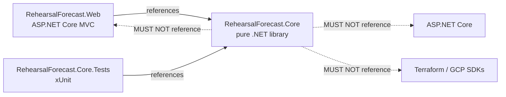
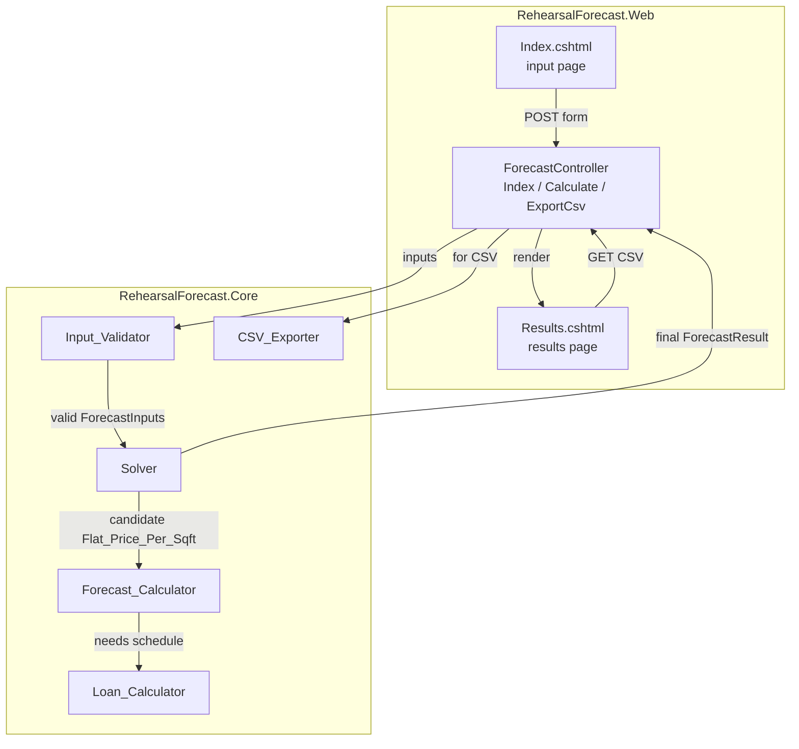

# Design Document

## Overview

The `Rehearsal_Forecast_Application` is a server-rendered ASP.NET Core MVC web application that produces a 36-month monthly financial forecast for a music rehearsal facility and computes the minimum constant 36-month flat rental price per square foot required for cumulative ending cash to reach and remain at $0 or above from a user-selected target month through Month 36.

The **authoritative output** of this phase is `Flat_Price_Per_Sqft` — a single per-square-foot price that applies to the entire 36-month period. The convenience quantity `Monthly_Price_Per_Sqft` is always defined as `Flat_Price_Per_Sqft / 36`; it is a derived display value, not an independent charged rate.

### Forecast window

The forecast is exactly 36 monthly rows, indexed 1..36. No shorter or longer horizon is supported in this phase.

### Business purpose (restated)

- Owner will purchase a warehouse and construct 150-sqft rental units inside it.
- Owner wants to know: "What is the minimum flat rental price, applied uniformly across the 36-month window, such that the business is cash-positive from my chosen target month through Month 36?"
- The application accepts financial inputs, produces the full monthly forecast, and runs a solver over `Flat_Price_Per_Sqft` to answer that question.

### Architectural principle

The core calculation engine (`RehearsalForecast.Core`) is **independent of ASP.NET Core, Razor, Terraform, and any UI abstraction**. It depends only on the .NET base class library. This separation is required by Requirement 20 and enables:

- Unit-testing every business rule without a web host.
- Evolving the UI (or replacing MVC entirely) without touching business logic.
- Replacing infrastructure without touching business logic.

### Non-goals for this phase

No database, no authentication, no cloud provisioning, no capital scheduling, no COGS, no variable `Owner_Withdrawals`, no editable `Standard_Unit_Size`. These are called out explicitly in Requirement 21.6 and Requirement 26.11.

### Numeric-type discipline

All monetary values, rates, ratios, and intermediate arithmetic use the C# `decimal` type. Binary floats (`double`, `float`) are prohibited in the calculation engine (Requirement 19).

---

## Architecture

### Project layout

The repository is a single .NET 10 solution. Project locations are fixed by Requirement 21.

```
UnitizationApp/
├── RehearsalForecast.sln
├── README.md
├── .gitignore
├── .dockerignore
├── Dockerfile
├── src/
│   ├── RehearsalForecast.Web/          # ASP.NET Core MVC web app
│   │   ├── Controllers/
│   │   ├── Views/
│   │   ├── ViewModels/
│   │   ├── ModelBinders/
│   │   ├── wwwroot/
│   │   ├── Program.cs
│   │   ├── appsettings.json
│   │   └── RehearsalForecast.Web.csproj
│   └── RehearsalForecast.Core/          # Pure calculation library
│       ├── Domain/                      # Input & result types
│       ├── Schedules/                   # MonthlySchedule<T> etc.
│       ├── Forecast/                    # ForecastCalculator
│       ├── Loan/                        # LoanCalculator
│       ├── Solving/                     # PriceSolver
│       ├── Validation/                  # InputValidator
│       ├── Export/                      # CsvExporter
│       ├── Constants/                   # ForecastConstants
│       └── RehearsalForecast.Core.csproj
├── tests/
│   └── RehearsalForecast.Core.Tests/    # xUnit test project
│       └── RehearsalForecast.Core.Tests.csproj
├── infrastructure/
│   └── terraform/
│       ├── modules/
│       │   └── cloud_run/
│       └── environments/
│           └── dev/
├── .github/
│   └── workflows/
│       └── ci.yml
└── .vscode/
    ├── launch.json
    └── tasks.json
```

### Dependency direction



- `RehearsalForecast.Web` references `RehearsalForecast.Core`.
- `RehearsalForecast.Core.Tests` references `RehearsalForecast.Core`.
- `RehearsalForecast.Core` references nothing outside the .NET BCL. This is enforced by having zero `PackageReference` and zero `ProjectReference` entries in the `.csproj` for anything web-, cloud-, or Terraform-related (Requirement 20.2, 20.3).

### Logical component diagram



### Responsibilities

| Component | Responsibility | Requirements |
|---|---|---|
| `Web_UI` | Render input page, bind form to view model, render results page and 36-month table. | 1, 4.6, 16, 17 |
| `Input_Validator` | Server-side validation of all inputs (attribute-based + cross-field). | 2, 27.9 |
| `Forecast_Calculator` | Produce a 36-month forecast for a given `ForecastInputs` and a given candidate `Flat_Price_Per_Sqft`. | 3–14, 27 |
| `Loan_Calculator` | Produce the 36-month amortization schedule from `Loan_Proceeds`, `Annual_Loan_Interest_Rate`, `Loan_Term_Months`. | 11 |
| `Solver` | Find minimum nonnegative `Flat_Price_Per_Sqft` satisfying `Cash_Positive_Rule`; round UP to two decimals; re-verify. | 15, 27.6 |
| `CSV_Exporter` | Emit deterministic CSV representation of the 36 forecast rows. | 18 |

### DI and interfaces policy (Requirement 20.4)

The core library uses **only interfaces that improve testability or separate meaningful responsibilities**:

- `ILoanCalculator` — allows the forecast calculator to be tested with a stub schedule.
- `IForecastCalculator` — allows the solver to be tested with a scripted forecast oracle.
- `ISolver` — allows the controller to be tested without running the full search.
- `ICsvExporter` — allows the controller to be tested without generating CSV bytes.

Everything else (view models, DTOs, `MonthlySchedule<T>`, `InputValidator` result records, constants) is a concrete type. We do **not** add interfaces solely for indirection.

DI registration lives in `RehearsalForecast.Web/Program.cs`. All core services are registered as `Scoped`.

### Infrastructure scaffolding (overview only)

- **Terraform** under `infrastructure/terraform/` — Cloud Run module + `dev` environment. `fmt`, `init -backend=false`, `validate` succeed. No `apply`.
- **GitHub Actions** — a single `ci.yml` that restores, builds, tests, publishes, builds the container image, and runs Terraform `fmt`/`init`/`validate`. No deploy.
- **Dockerfile** — multi-stage: `mcr.microsoft.com/dotnet/sdk:10.0` for build, `mcr.microsoft.com/dotnet/aspnet:10.0` for runtime, honoring `PORT`.
- **.vscode/** — build, run, watch, test tasks and a launch profile for the web project.

Details for each are in §13–§16.

---

## Components and Interfaces

This section fixes the public shape of each component. Full domain-type definitions are in the **Domain Model** section (§4). Algorithmic detail is in §5–§6.

### 4.1 `IForecastCalculator`

```csharp
namespace RehearsalForecast.Core.Forecast;

public interface IForecastCalculator
{
    /// <summary>
    /// Produces a complete 36-month forecast for the given inputs and a
    /// specified Flat_Price_Per_Sqft. The candidate price is what the
    /// Solver iterates over; callers who already know the final price call
    /// this once.
    /// </summary>
    ForecastResult Compute(ForecastInputs inputs, decimal flatPricePerSqft);
}
```

### 4.2 `ILoanCalculator`

```csharp
namespace RehearsalForecast.Core.Loan;

public interface ILoanCalculator
{
    /// <summary>
    /// Produces a 36-month amortization schedule. Rows beyond
    /// Loan_Term_Months (when term < 36) contain zeros. Rows within the
    /// forecast window but before payoff (when term > 36) show the
    /// residual outstanding balance at Loan_Ending_Balance[36].
    /// </summary>
    LoanSchedule Compute(
        decimal loanProceeds,
        decimal annualInterestRate,
        int loanTermMonths);
}
```

### 4.3 `ISolver`

```csharp
namespace RehearsalForecast.Core.Solving;

public interface ISolver
{
    /// <summary>
    /// Returns the minimum nonnegative Flat_Price_Per_Sqft (rounded UP to
    /// Currency_Precision) that satisfies the Cash_Positive_Rule, or a
    /// solver-failure result when Solver_Safety_Limit is exceeded.
    /// </summary>
    SolverResult Solve(ForecastInputs inputs);
}
```

### 4.4 `IInputValidator`

```csharp
namespace RehearsalForecast.Core.Validation;

public interface IInputValidator
{
    /// <summary>
    /// Applies all cross-field and structural rules from Requirement 2.
    /// Field-shape validation is enforced by data annotations at
    /// model-binding time; this method covers rules that cannot be
    /// expressed as a single-field attribute.
    /// </summary>
    ValidationOutcome Validate(ForecastInputs inputs);
}
```

### 4.5 `ICsvExporter`

```csharp
namespace RehearsalForecast.Core.Export;

public interface ICsvExporter
{
    /// <summary>
    /// Serializes a ForecastResult to a deterministic CSV byte stream.
    /// </summary>
    byte[] Export(ForecastResult result);

    string FileName(DateTimeOffset now);
}
```

---

## Data Models

All types live in `RehearsalForecast.Core`. All monetary and ratio values are `decimal`. Nullable reference types are enabled.

### 5.1 Constants — `RehearsalForecast.Core.Constants.ForecastConstants`

```csharp
namespace RehearsalForecast.Core.Constants;

public static class ForecastConstants
{
    /// <summary>Floor area of one rental unit, fixed for this phase. Requirement 3.4.</summary>
    public const decimal StandardUnitSize = 150m;

    /// <summary>Derived payroll-tax rate applied to Wages. Requirement 7.2.</summary>
    public const decimal PayrollTaxRate = 0.0765m;

    /// <summary>Two decimal places (USD cents). Requirement 15.8.</summary>
    public const int CurrencyDecimals = 2;

    /// <summary>Smallest positive step in USD cents: 0.01. Requirement 15.10.</summary>
    public const decimal CurrencyPrecision = 0.01m;

    /// <summary>Convergence tolerance for the binary search (USD). Requirement 15.6.</summary>
    public const decimal SolverTolerance = 0.0001m;

    /// <summary>Maximum solver iterations before returning a failure. Requirement 15.11.</summary>
    public const int SolverSafetyLimit = 200;

    /// <summary>Forecast horizon in months.</summary>
    public const int ForecastMonths = 36;
}
```

`StandardUnitSize` is the single named constant for 150; no other calculation-code literal `150m` is permitted (Requirement 3.4 wording: "single named constant with no other literal occurrences of 150").

### 5.2 Uniform schedule type — `MonthlySchedule<T>`

To satisfy Requirement 1 (constant-or-variable inputs) uniformly across the calculator, we define a single value type used for every schedulable input.

```csharp
namespace RehearsalForecast.Core.Schedules;

public enum ScheduleMode { Constant, Variable }

/// <summary>
/// A value that is either a single constant applied to all 36 months,
/// or an explicit 36-element sequence.
/// </summary>
public sealed class MonthlySchedule<T> where T : struct
{
    public ScheduleMode Mode { get; }
    public T ConstantValue { get; }
    public IReadOnlyList<T> MonthlyValues { get; } // length is always 36

    public static MonthlySchedule<T> Constant(T value);
    public static MonthlySchedule<T> Variable(IReadOnlyList<T> monthlyValues);

    /// <summary>1-based month accessor (m in [1, 36]).</summary>
    public T At(int month);
}
```

`At(month)` returns `ConstantValue` in `Constant` mode and `MonthlyValues[month - 1]` in `Variable` mode. Callers in the calculator use `At(m)` uniformly — the calculator does not care whether the value is constant or variable.

### 5.3 `ForecastInputs`

Grouped by Requirement 17's input sections. Nested record classes make the domain readable and keep model binding straightforward. All amount fields are `decimal`; all rate fields are decimals in [0, 1]; `Owner_Withdrawals` is a scalar (Requirement 1.6, Design Decision 8).

```csharp
namespace RehearsalForecast.Core.Domain;

public sealed record ForecastInputs(
    CapitalInputs Capital,
    MarketingInputs Marketing,
    OperationsInputs Operations,
    BuildingInputs Building,
    LoanInputs Loan,
    TaxInputs Taxes,
    OwnerActivityInputs OwnerActivity,
    ForecastControlInputs ForecastControls);

public sealed record CapitalInputs(
    decimal Equipment,
    decimal TotalImprovementCost,
    decimal BuildingPurchaseCost,
    decimal OtherCapitalCost);

public sealed record MarketingInputs(
    MonthlySchedule<decimal> Print,
    MonthlySchedule<decimal> Search,
    MonthlySchedule<decimal> Social,
    MonthlySchedule<decimal> OtherMarketing);

public sealed record OperationsInputs(
    MonthlySchedule<decimal> Accounting,
    MonthlySchedule<decimal> Custodial,
    MonthlySchedule<decimal> Gas,
    MonthlySchedule<decimal> Insurance,
    MonthlySchedule<decimal> It,
    MonthlySchedule<decimal> OfficeSupplies,
    MonthlySchedule<decimal> ProfessionalServices,
    MonthlySchedule<decimal> RentExpense,
    MonthlySchedule<decimal> Repairs,
    MonthlySchedule<decimal> Shipping,
    MonthlySchedule<decimal> PropertyTax,
    MonthlySchedule<decimal> Utilities,
    MonthlySchedule<decimal> Wages,
    MonthlySchedule<decimal> OtherOperations);

public sealed record BuildingInputs(
    decimal TotalSqft,
    decimal PercentageAvailableForRent,      // [0, 1]
    decimal TotalBuildingCost,                // depreciable amount
    decimal LandValue,                        // display only, not used
    int DepreciationPeriodYears,              // > 0
    OccupancySchedule Occupancy);

public sealed record OccupancySchedule(
    bool UseDefault,                          // default = min(m*0.10, 1.00)
    IReadOnlyList<decimal>? UserRates);       // length 36 when UseDefault=false

public sealed record LoanInputs(
    decimal AnnualLoanInterestRate,           // >= 0
    int LoanTermMonths);                       // > 0

public sealed record TaxInputs(
    decimal IncomeTaxRate);                    // [0, 1]

public sealed record OwnerActivityInputs(
    decimal OwnerInvestment,                   // >= 0
    decimal OwnerWithdrawals);                 // >= 0 scalar only (Req 1.6)

public sealed record ForecastControlInputs(
    decimal BeginningCashMonth1,
    int TargetCashPositiveMonth);              // [1, 36]
```

Notes:

- `LandValue` is captured but is never used in a calculation (Requirement 8.5, Design Decision 1).
- `Total_Building_Cost` is the depreciable amount (Design Decision 1).
- `Owner_Withdrawals` is a single scalar (Design Decision 8).
- `Loan_Proceeds` is derived; it is not a user input.

### 5.4 `MonthlyForecastRow`

Every field required by Requirement 16.5 for the 36-row output table:

```csharp
public sealed record MonthlyForecastRow(
    int Month,                                 // 1..36
    decimal OccupancyRate,
    int TotalRentalUnits,
    int RentedUnits,
    decimal RentedSqft,
    decimal MonthlyPricePerSqft,
    decimal GrossRevenue,
    decimal GrossIncome,
    decimal MarketingTotal,
    decimal OperationsTotal,
    decimal Wages,
    decimal PayrollTax,
    decimal LoanBeginningBalance,
    decimal MonthlyLoanPayment,
    decimal MonthlyLoanInterest,
    decimal MonthlyLoanPrincipal,
    decimal LoanEndingBalance,
    decimal MonthlyDepreciation,
    decimal PreTaxIncome,
    decimal IncomeTax,
    decimal TotalExpenses,
    decimal NetIncome,
    decimal BeginningCash,
    decimal OwnerInvestmentInMonth,
    decimal LoanProceedsInMonth,
    decimal CapitalExpendituresInMonth,
    decimal OwnerWithdrawals,
    decimal EndingCash,
    bool CashPositiveStatus);
```

`CashPositiveStatus` is `EndingCash >= 0` for that specific month.

### 5.5 `ForecastResult`

```csharp
public sealed record ForecastResult(
    // Summary metrics — Requirement 16.4
    decimal TotalCapital,
    decimal OwnerInvestment,
    decimal LoanProceeds,
    decimal RentableSqft,
    int TotalRentalUnits,

    // Authoritative outputs
    decimal FlatPricePerSqft,
    decimal MonthlyPricePerSqft,

    // Cash-positive result — Requirement 14, 16.3
    int TargetCashPositiveMonth,
    bool CashPositiveRuleSatisfied,
    int? FirstSustainedNonnegativeMonth,       // null renders as "None"

    // Full detail
    IReadOnlyList<MonthlyForecastRow> Rows);   // exactly 36
```

### 5.6 `LoanSchedule`

```csharp
public sealed record LoanScheduleEntry(
    int Month,                                  // 1..36
    decimal BeginningBalance,
    decimal Payment,
    decimal Interest,
    decimal Principal,
    decimal EndingBalance);

public sealed record LoanSchedule(
    decimal MonthlyPayment,                     // 0 when Loan_Proceeds = 0
    IReadOnlyList<LoanScheduleEntry> Entries);  // exactly 36
```

### 5.7 `SolverResult`

Discriminated-style result using an abstract base plus two concrete records:

```csharp
public abstract record SolverResult
{
    private SolverResult() { }

    public sealed record Success(
        decimal FlatPricePerSqft,
        ForecastResult Forecast,
        int Iterations) : SolverResult;

    public sealed record Failure(
        string Reason,
        int Iterations) : SolverResult;
}
```

### 5.8 `ValidationOutcome`

```csharp
public sealed record ValidationError(
    string FieldPath,          // e.g. "Building.PercentageAvailableForRent"
    string Message);

public sealed record ValidationOutcome(
    bool IsValid,
    IReadOnlyList<ValidationError> Errors);
```

---

## Forecast Calculator Algorithm

`ForecastCalculator.Compute(ForecastInputs inputs, decimal flatPricePerSqft)` runs the following passes in order. Each step cites the requirement it satisfies.

### 6.1 Pass 1 — Building geometry (Requirement 3)

```
Rentable_Sqft         = Total_Sqft * Percentage_Available_For_Rent
Total_Rental_Units    = ceil(Rentable_Sqft / StandardUnitSize)   // 0 when Rentable_Sqft = 0 (R3.3)
```

### 6.2 Pass 2 — Occupancy schedule (Requirement 4)

```
if OccupancySchedule.UseDefault:
    for m in 1..36:
        Occupancy_Rate[m] = min(m * 0.10, 1.00)   // saturates from month 10 onward
else:
    for m in 1..36:
        Occupancy_Rate[m] = OccupancySchedule.UserRates[m-1]
```

Then per month:

```
Rented_Units[m] = clamp(ceil(Total_Rental_Units * Occupancy_Rate[m]), 0, Total_Rental_Units)
Rented_Sqft[m]  = min(Rented_Units[m] * StandardUnitSize, Rentable_Sqft)     // R4.5, DD5
```

### 6.3 Pass 3 — Revenue (Requirement 5)

```
Monthly_Price_Per_Sqft = flatPricePerSqft / 36
for m in 1..36:
    Gross_Revenue[m] = Rented_Sqft[m] * Monthly_Price_Per_Sqft
    Gross_Income[m]  = Gross_Revenue[m]                     // COGS out of scope (DD6)
```

### 6.4 Pass 4 — Marketing (Requirement 6)

For each month `m` in 1..36:

```
Marketing_Total[m] = Print.At(m) + Search.At(m) + Social.At(m) + OtherMarketing.At(m)
```

### 6.5 Pass 5 — Operations and payroll tax (Requirement 7)

For each month `m` in 1..36:

```
Wages_m         = Wages.At(m)
Payroll_Tax_m   = Wages_m * PayrollTaxRate                 // 0.0765

Operations_Total[m] =
    Accounting.At(m) + Custodial.At(m) + Gas.At(m) + Insurance.At(m)
  + It.At(m) + OfficeSupplies.At(m) + ProfessionalServices.At(m)
  + RentExpense.At(m) + Repairs.At(m) + Shipping.At(m)
  + PropertyTax.At(m) + Utilities.At(m) + Wages_m + OtherOperations.At(m)
  + Payroll_Tax_m
```

`Monthly_Loan_Interest` and `Monthly_Depreciation` are explicitly excluded from `Operations_Total` (R7.5).

### 6.6 Pass 6 — Depreciation (Requirement 8)

```
Monthly_Depreciation = Total_Building_Cost / (Depreciation_Period_Years * 12)
```

Applied identically to every month (R8.2). `Land_Value` and non-building capital line items are **not** included in the depreciable amount (R8.3, R8.4, DD1).

### 6.7 Pass 7 — Capital and financing sizing (Requirements 9, 10)

Computed once (not per month):

```
Total_Capital     = Equipment + TotalImprovementCost + BuildingPurchaseCost + OtherCapitalCost
Owner_Investment  = inputs.OwnerActivity.OwnerInvestment
Loan_Proceeds     = max(Total_Capital - Owner_Investment, 0)

Capital_Expenditures_In_Month[1]   = Total_Capital
Capital_Expenditures_In_Month[m>1] = 0

Owner_Investment_In_Month[1]       = Owner_Investment
Owner_Investment_In_Month[m>1]     = 0

Loan_Proceeds_In_Month[1]          = Loan_Proceeds
Loan_Proceeds_In_Month[m>1]        = 0
```

R10.2 requirement: even if `Owner_Investment > Total_Capital`, `Total_Capital` remains the capital-expenditure amount (owner over-investment sits in Beginning_Cash effectively; it is not netted against capex).

### 6.8 Pass 8 — Loan amortization (Requirement 11)

Delegate to `ILoanCalculator.Compute(Loan_Proceeds, AnnualLoanInterestRate, LoanTermMonths)`. See §7. Returns 36 `LoanScheduleEntry` rows.

### 6.9 Pass 9 — Pre-tax income, income tax, net income (Requirement 12)

For each month `m` in 1..36:

```
Expenses_Before_Income_Tax[m] =
    Marketing_Total[m] + Operations_Total[m]
  + LoanEntry[m].Interest + Monthly_Depreciation

Pre_Tax_Income[m] = Gross_Income[m] - Expenses_Before_Income_Tax[m]
Income_Tax[m]     = max(Pre_Tax_Income[m], 0) * Income_Tax_Rate       // R12.3, R12.4
Total_Expenses[m] = Expenses_Before_Income_Tax[m] + Income_Tax[m]
Net_Income[m]     = Gross_Income[m] - Total_Expenses[m]
```

Losses are **not** carried forward across months (R12.7).

### 6.10 Pass 10 — Cash-flow roll-forward (Requirement 13)

Sign convention: additions increase `Ending_Cash`, subtractions decrease it (R13.7).

For `m = 1`:

```
Beginning_Cash[1] = inputs.ForecastControls.BeginningCashMonth1     // R13.2
```

For `m in 2..36`:

```
Beginning_Cash[m] = Ending_Cash[m-1]                                // R13.3
```

Then, for every `m in 1..36` (R13.4, exactly the formula in the requirements):

```
Ending_Cash[m] =
    Beginning_Cash[m]
  + Owner_Investment_In_Month[m]
  + Loan_Proceeds_In_Month[m]
  + Net_Income[m]
  + Monthly_Depreciation                        // add-back of non-cash expense (R13.5)
  - Capital_Expenditures_In_Month[m]
  - LoanEntry[m].Principal                      // principal only (R11.14, R13.7)
  - Owner_Withdrawals                           // constant every month (R13.6, DD8)
```

Two explicit correctness anchors:

- **Depreciation add-back**: `Monthly_Depreciation` was already subtracted inside `Net_Income[m]` via `Expenses_Before_Income_Tax`. Because it is non-cash, we add it back in the cash-flow line (R13.5).
- **Principal-only**: `Monthly_Loan_Interest[m]` was already treated as an expense inside `Net_Income[m]`. Only `Monthly_Loan_Principal[m]` reduces cash (R11.14).

### 6.11 Pass 11 — Cash-positive rule (Requirement 14)

```
target = inputs.ForecastControls.TargetCashPositiveMonth

Cash_Positive_Rule_Satisfied =
    Ending_Cash[target] >= 0
    AND for every m in [target+1, 36]: Ending_Cash[m] >= 0

// target = 36 collapses to "Ending_Cash[36] >= 0 only" (R27.8)

First_Sustained_Nonnegative_Month =
    the smallest M in [1, 36] such that for every m in [M, 36], Ending_Cash[m] >= 0
    // "None" (encoded as null) when no such M exists (R14.5, DD9)
```

### 6.12 Pass 12 — Assemble `ForecastResult`

Return a `ForecastResult` populated with summary metrics, all 36 `MonthlyForecastRow` records, `CashPositiveRuleSatisfied`, and `FirstSustainedNonnegativeMonth`.

---

## Loan Calculator Algorithm

`LoanCalculator.Compute(loanProceeds, annualRate, termMonths)` handles four regimes uniformly and always returns exactly 36 entries.

### 7.1 Zero-proceeds case (R11.1)

If `loanProceeds == 0`:

```
MonthlyPayment = 0
for m in 1..36: emit LoanScheduleEntry(m, 0, 0, 0, 0, 0)
```

### 7.2 Zero-interest case (R11.2)

If `loanProceeds > 0 && annualRate == 0`:

```
MonthlyPayment = loanProceeds / termMonths
Balance        = loanProceeds

for m in 1..36:
    if m > termMonths:
        emit (m, 0, 0, 0, 0, 0)
        continue

    Interest_m  = 0
    Principal_m = min(MonthlyPayment, Balance)
    if m == termMonths:
        // R11.12: final-payment residual adjustment
        Principal_m = Balance
    Ending      = max(Balance - Principal_m, 0)
    emit (m, Balance, MonthlyPayment, 0, Principal_m, Ending)
    Balance = Ending
```

### 7.3 Positive-interest case (R11.3)

Monthly rate:

```
i = annualRate / 12
```

Standard fixed-payment fully amortizing formula:

```
MonthlyPayment = Loan_Proceeds * (i * (1 + i)^termMonths) / ((1 + i)^termMonths - 1)
```

Because `decimal` has no native `Pow`, `(1 + i)^termMonths` is computed with a loop of `decimal` multiplications (deterministic, decimal-only — R19.1, R19.2). No conversion to `double`.

Then, for each month:

```
Balance = loanProceeds
for m in 1..36:
    if m > termMonths:
        emit (m, 0, 0, 0, 0, 0)
        continue

    Interest_m  = Balance * i
    Principal_m = min(MonthlyPayment - Interest_m, Balance)
    if m == termMonths:
        // R11.12: absorb rounding residual into the final month
        Principal_m = Balance
    Ending      = max(Balance - Principal_m, 0)
    emit (m, Balance, MonthlyPayment, Interest_m, Principal_m, Ending)
    Balance = Ending
```

### 7.4 Term shorter or longer than 36 months

- `termMonths < 36`: rows `m > termMonths` are `(m, 0, 0, 0, 0, 0)` (R11.10). The final-month residual adjustment guarantees `Loan_Ending_Balance[termMonths] == 0`.
- `termMonths > 36`: we emit 36 rows normally, without collapsing the residual. `Loan_Ending_Balance[36]` is positive (R11.11).
- `termMonths == 36`: standard schedule; final-month residual adjustment applies at month 36.

### 7.5 Declining-interest invariant

While `Loan_Beginning_Balance[m] > 0` and `annualRate > 0`, `Monthly_Loan_Interest[m+1] <= Monthly_Loan_Interest[m]` because the ending balance is monotonically non-increasing. This is enforced structurally by the algorithm; it is also asserted by a correctness property (§10, Property 6).

---

## Solver Algorithm

`Solver.Solve(inputs)` performs a deterministic bounded binary search over `Flat_Price_Per_Sqft` using `decimal` throughout (Requirement 15).

### 8.1 Cash-positive predicate

```
bool Satisfies(decimal p):
    result = forecastCalculator.Compute(inputs, p)
    return result.CashPositiveRuleSatisfied
```

Each candidate triggers a fresh `Compute` (R15.7). No forecast is cached across candidates.

### 8.2 Fast path — price of zero already works (R15.3, R15.4, DD12)

```
if Satisfies(0m):
    return Success(0m, forecast_at_zero, iterations=1)
```

### 8.3 Geometric upper-bound expansion (R15.5)

```
high = 1m
iter = 1
while not Satisfies(high):
    iter += 1
    if iter > SolverSafetyLimit:
        return Failure("upper bound not found", iter)
    high *= 2m
low = high / 2m           // last known infeasible value
```

Doubling gives O(log(price)) iterations to bracket the answer regardless of scale.

### 8.4 Bisection to `SolverTolerance` (R15.6)

```
while (high - low) > SolverTolerance:
    iter += 1
    if iter > SolverSafetyLimit:
        return Failure("bisection safety limit", iter)
    mid = (low + high) / 2m
    if Satisfies(mid):
        high = mid
    else:
        low = mid
```

After the loop, `high` is the smallest tolerated value that satisfies the rule.

### 8.5 Round UP to `CurrencyPrecision` (R15.8)

```
rounded = ceil_to_cents(high)      // = Math.Ceiling(high * 100m) / 100m
```

Because `ceil` moves the price upward, monotonicity of "cash-positive" in `p` normally means the rounded value still satisfies the rule. R15.9–R15.10 and R27.6 nonetheless require re-verification and an incremental raise if it fails.

### 8.6 Re-verify and incremental raise (R15.9, R15.10, R27.6)

```
while not Satisfies(rounded):
    iter += 1
    if iter > SolverSafetyLimit:
        return Failure("post-rounding raise safety limit", iter)
    rounded += CurrencyPrecision     // 0.01 USD per step
```

### 8.7 Success

```
finalForecast = forecastCalculator.Compute(inputs, rounded)
return Success(rounded, finalForecast, iter)
```

### 8.8 Safety limit and failure semantics (R15.11)

The `SolverSafetyLimit` guard is checked in all three loops. On breach we return `SolverResult.Failure` with a human-readable message. The solver never throws an unhandled exception, never loops indefinitely, and never returns a `Success` for an unsatisfied `Cash_Positive_Rule`.

### 8.9 Monotonicity note

Because `Gross_Revenue[m]` is linear in `Flat_Price_Per_Sqft` and every downstream deduction is either constant or a non-decreasing linear function of positive income (`Income_Tax` is `max(pre_tax, 0) * rate`), `Ending_Cash[m]` is non-decreasing in `Flat_Price_Per_Sqft` for every `m`. This monotonicity is what makes bisection valid; it is verified as a correctness property (§10, Property 10).

---

## Constant / Variable Schedule Handling

Requirement 1 divides inputs into three groups:

| Group | Examples | Storage |
|---|---|---|
| **Schedulable** (constant OR variable) | Print, Search, Social, Other_Marketing, all Operations line items (incl. Wages), Occupancy_Rate | `MonthlySchedule<decimal>` or `OccupancySchedule` |
| **Scalar-only** (R1.7) | Total_Building_Cost, Land_Value, Beginning_Cash Month 1, Owner_Investment, Total_Sqft, Percentage_Available_For_Rent, Annual_Loan_Interest_Rate, Loan_Term_Months, Depreciation_Period_Years, Income_Tax_Rate, Target_Cash_Positive_Month, Equipment, Total_Improvement_Cost, Building_Purchase_Cost, Other_Capital_Cost | `decimal` / `int` |
| **Scalar-only by special rule** | Owner_Withdrawals (R1.6, DD8) | `decimal` |
| **Derived** (read-only) | Payroll_Tax, Monthly_Loan_Interest, Monthly_Loan_Principal, Monthly_Depreciation, Rentable_Sqft, Total_Rental_Units, Rented_Units, Rented_Sqft, Monthly_Price_Per_Sqft, Loan_Proceeds | Not user input; computed by `ForecastCalculator` and rendered read-only (R1.8) |

### 9.1 Web_UI interaction

For every schedulable input the input page renders:

- A radio group `[Constant] / [Variable]` (R1.1).
- When `Constant`: a single numeric field.
- When `Variable`: 36 numeric fields (labeled Month 1..36) (R1.4).

The current mode is visually distinguishable (R1.5), for example by shading the active subform and adding an "active" badge to the mode label.

Switching modes is a deliberate action (R1.3, R4.7): clicking the `Variable` radio triggers a server round-trip (or a small progressive-enhancement JS handler used purely for UX — validation always happens server-side per R2.11) that:

- Reads the current constant value.
- Pre-populates all 36 monthly fields with that value.
- Persists the new mode in the view model.

For Occupancy_Rate specifically, switching to Variable pre-populates the 36 fields with the default schedule values `min(m*0.10, 1.00)` (R4.7).

### 9.2 Input_Validator interaction

`ValidateVariableMode(schedule, fieldName)`:

- If `schedule.Mode == Variable`, assert `schedule.MonthlyValues.Count == 36`; otherwise emit `ValidationError(fieldName + "[]", "must supply exactly 36 monthly values")` (R2.9).
- Every entry must be a valid decimal (enforced at model-binding time by the numeric type).
- For Occupancy_Rate, every entry must be in `[0, 1]` and errors identify the offending month (R2.10).

### 9.3 Forecast_Calculator interaction

The calculator never branches on `Mode`. It always calls `schedule.At(m)` — this is the entire point of `MonthlySchedule<T>` (R1.2, R6.2).

### 9.4 Custom model binding

Because model binding for 36 explicit fields per schedule is verbose, we implement a small custom `IModelBinder` (`MonthlyScheduleModelBinder`) that reads:

- `<prefix>.Mode` (`Constant` or `Variable`)
- `<prefix>.ConstantValue`
- `<prefix>.MonthlyValues[0]` .. `<prefix>.MonthlyValues[35]`

and constructs a `MonthlySchedule<decimal>` on the view model. `OccupancySchedule` gets its own tiny binder because it does not use `MonthlySchedule<T>` (it toggles between "default formula" and "user rates").

---

## Input Validation

### 10.1 Where validation lives

Two layers:

1. **Data annotations on `ForecastInputViewModel`** — cover single-field range checks that map naturally to attributes: `[Range(0, double.MaxValue)]`, `[Range(0.0, 1.0)]`, `[Range(1, 36)]`, `[Required]`. These fire during model binding and populate `ModelState` (R2.11).
2. **`InputValidator` in `RehearsalForecast.Core`** — covers rules that cross fields or that inspect a `MonthlySchedule<decimal>`. Runs after the view model is mapped to `ForecastInputs`.

Both layers are **server-side** (R2.11). No validation depends on JavaScript.

### 10.2 Attribute-based rules

| Rule | Attribute |
|---|---|
| R2.1 `Total_Sqft >= 0` | `[Range(0, double.MaxValue)]` on `TotalSqft` |
| R2.2 `Percentage_Available_For_Rent in [0, 1]` | `[Range(0.0, 1.0)]` |
| R2.3 `Depreciation_Period_Years > 0` | `[Range(1, int.MaxValue)]` |
| R2.4 `Loan_Term_Months > 0` | `[Range(1, int.MaxValue)]` |
| R2.5 `Annual_Loan_Interest_Rate >= 0` | `[Range(0.0, double.MaxValue)]` |
| R2.6 `Income_Tax_Rate in [0, 1]` | `[Range(0.0, 1.0)]` |
| R2.7 all money-like inputs non-negative | `[Range(0.0, double.MaxValue)]` on every capital / marketing / operations / owner-activity numeric |
| R2.8 `Target_Cash_Positive_Month in [1, 36]` | `[Range(1, 36)]` |

### 10.3 Cross-field / structural rules in `InputValidator`

- R2.9 variable-mode schedules must have exactly 36 values.
- R2.10 user-supplied `Occupancy_Rate` entries must each be in `[0, 1]`; errors identify the offending month.
- R10.5 explicitly permits `Owner_Investment > Total_Capital`; no validation blocks it.

### 10.4 Error surfacing

- On failure the controller re-renders `Index.cshtml` with the original view model (R17.5, R2.12).
- A `<div asp-validation-summary="All">` sits at the top of the page.
- Each field renders `<span asp-validation-for="...">` for inline errors.
- Schedule per-month errors surface next to the offending month's cell.

### 10.5 Guarantee on calculator invocation (R2.13, R27.9)

The `Calculate` action strictly returns to `Index.cshtml` on validation failure. `ForecastCalculator.Compute` and `Solver.Solve` are only called when `ModelState.IsValid && validator.Validate(...).IsValid`. Silent coercion of invalid values is forbidden.

---

## ASP.NET Core MVC Design

### 11.1 Controller

```csharp
namespace RehearsalForecast.Web.Controllers;

public sealed class ForecastController : Controller
{
    private readonly IInputValidator _validator;
    private readonly ISolver _solver;
    private readonly ICsvExporter _csv;

    // GET /
    public IActionResult Index();

    // POST /Forecast/Calculate
    [HttpPost, ValidateAntiForgeryToken]
    public IActionResult Calculate(ForecastInputViewModel vm);

    // POST /Forecast/ExportCsv
    [HttpPost, ValidateAntiForgeryToken]
    public IActionResult ExportCsv(ForecastInputViewModel vm);
}
```

Routes:

- `GET /` and `GET /Forecast/Index` → the input page.
- `POST /Forecast/Calculate` → validate → solve → render `Results.cshtml`.
- `POST /Forecast/ExportCsv` → validate → solve → return CSV.

`Home` controller is not used; `ForecastController.Index` is the default route via `MapControllerRoute("default", "{controller=Forecast}/{action=Index}/{id?}")`.

### 11.2 View models

```csharp
namespace RehearsalForecast.Web.ViewModels;

public sealed class ForecastInputViewModel
{
    // Grouped by input section; every schedulable field is a
    // MonthlyScheduleViewModel<decimal>.
    public CapitalInputSection Capital { get; set; }
    public MarketingInputSection Marketing { get; set; }
    public OperationsInputSection Operations { get; set; }
    public BuildingInputSection Building { get; set; }
    public LoanInputSection Loan { get; set; }
    public TaxInputSection Taxes { get; set; }
    public OwnerActivityInputSection OwnerActivity { get; set; }
    public ForecastControlInputSection ForecastControls { get; set; }

    public ForecastInputs ToDomain();     // maps to Core.Domain.ForecastInputs
}

public sealed class MonthlyScheduleViewModel
{
    public ScheduleMode Mode { get; set; }
    public decimal ConstantValue { get; set; }
    public List<decimal> MonthlyValues { get; set; } = new(new decimal[36]);
}
```

```csharp
public sealed class ForecastResultViewModel
{
    public ForecastInputViewModel Inputs { get; init; }     // to round-trip for CSV
    public ForecastResult Result { get; init; }
    public string? SolverFailureMessage { get; init; }
}
```

### 11.3 Views

- `Views/Forecast/Index.cshtml` — the input page. Renders the eight labeled sections (§12). Uses partial views (`_MonthlyScheduleEditor.cshtml`, `_OccupancyEditor.cshtml`) for reuse.
- `Views/Forecast/Results.cshtml` — the results page. Renders summary metrics (Requirement 16.1–16.4), the 36-row detail table (16.5), Cash_Positive_Rule outcome, `First_Sustained_Nonnegative_Month`, and an "Export CSV" button (form that POSTs the current inputs to `ExportCsv`).
- `Views/Shared/_Layout.cshtml`, `Views/Shared/_ValidationScriptsPartial.cshtml` (only for basic UI hints; validation is server-side).

### 11.4 Model binding for constant-vs-variable inputs

Custom `MonthlyScheduleModelBinder` (see §9.4) is registered via `MonthlyScheduleModelBinderProvider` in `Program.cs`.

### 11.5 Antiforgery

Both POST actions are decorated with `[ValidateAntiForgeryToken]`. Both forms include `@Html.AntiForgeryToken()`.

### 11.6 State passing between Calculate and CSV export — decision

**Decision: recompute on `ExportCsv` from the same input view model.**

The `Results` view includes a hidden form that round-trips the original inputs (`ForecastInputViewModel` as hidden fields, or serialized to a JSON hidden field for compactness) and POSTs to `ExportCsv`. `ExportCsv` runs the same validate → solve → export pipeline.

**Why not TempData or session:**

- TempData is short-lived and cookie-backed; the 36-month view model with variable schedules exceeds practical cookie sizes.
- Session state introduces server-side storage and cross-instance concerns on Cloud Run (multiple replicas).
- Recomputation is deterministic (same inputs → same outputs; Requirement 18.9), inexpensive at this scale (36 iterations × modest solver work), and matches R18.8's "SHALL NOT persist data to a database or to server-side temporary storage between requests."

**Trade-off:** the results page must re-run the solver on export. Given the solver's bounded iteration budget and pure-decimal arithmetic, this is well under 100 ms in practice and worth the architectural simplicity.

---

## CSV Export Design

`CsvExporter` (implements `ICsvExporter`) produces the CSV bytes; the controller wraps them in a `FileContentResult`.

### 12.1 Column shape

One header row plus exactly 36 data rows (R18.1). Column order is fixed and identical to the results-page table, followed by `Flat_Price_Per_Sqft` as a repeated column value on every row (R18.3):

```
Month, Occupancy_Rate, Total_Rental_Units, Rented_Units, Rented_Sqft,
Monthly_Price_Per_Sqft, Gross_Revenue, Gross_Income, Marketing_Total,
Operations_Total, Wages, Payroll_Tax, Loan_Beginning_Balance,
Monthly_Loan_Payment, Monthly_Loan_Interest, Monthly_Loan_Principal,
Loan_Ending_Balance, Monthly_Depreciation, Pre_Tax_Income, Income_Tax,
Total_Expenses, Net_Income, Beginning_Cash, Owner_Investment_In_Month,
Loan_Proceeds_In_Month, Capital_Expenditures_In_Month, Owner_Withdrawals,
Ending_Cash, Cash_Positive_Status, Flat_Price_Per_Sqft
```

Header column names and order are stable across exports of forecasts with equivalent structure (R18.2).

### 12.2 Numeric formatting (R18.5)

All decimals are formatted with `CultureInfo.InvariantCulture` using `ToString("0.############", InvariantCulture)`, which yields:

- period `.` as decimal separator,
- no thousands separator,
- no trailing zeros beyond the ones present.

Currency values written on-page are formatted differently (with `$` and two decimals for `Flat_Price_Per_Sqft`, `Monthly_Price_Per_Sqft`), but the CSV column values are raw invariant-culture decimals.

### 12.3 Quoting rules (R18.4)

Any field containing `,`, `"`, CR, or LF is wrapped in `"…"`; any embedded `"` is doubled. Plain fields are emitted unquoted. Line terminator is `\r\n`.

### 12.4 CSV-formula-injection prevention (R18.6)

Before applying quoting, any user-controlled **text** field whose first character is `=`, `+`, `-`, `@`, tab (`\t`), or CR (`\r`) is prefixed with a single leading apostrophe `'`. In this phase we do not export any user-controlled text (numeric columns and enum-like fields only), but the utility is implemented and used defensively so future additions cannot regress. Numeric-typed columns are exempt because their emitted representation cannot begin with `@` or `\t`.

### 12.5 `Cash_Positive_Status` encoding

`true` → `Yes`, `false` → `No`. This is not a user-controlled string so formula-injection prevention does not need to fire, but the utility still passes both values through the same sanitizer for uniformity.

### 12.6 HTTP response (R18.7)

```
Content-Type:        text/csv
Content-Disposition: attachment; filename="rehearsal-forecast-{yyyyMMdd-HHmmss}.csv"
```

Filename is generated via `ICsvExporter.FileName(now)`.

### 12.7 Determinism (R18.9)

For a fixed `ForecastInputs`, the exported bytes are identical across invocations:

- Column order, quoting rules, and number format are deterministic.
- The solver is deterministic (bisection over `decimal`).
- No timestamps or GUIDs appear in the CSV body itself. The filename encodes the download time but not the body content.

### 12.8 No persistence (R18.8)

`ExportCsv` runs the entire pipeline from the request-provided view model and returns bytes; no server-side storage, database, or temporary file participates.

---

## Web UI Structure

### 13.1 Input page layout (`Index.cshtml`)

Eight sections in the order specified in Requirement 17.1:

```
┌─────────────────────────────────────────────────────────────────┐
│  Rehearsal Forecast                                             │
│  [validation summary — shown only when errors present]          │
├─────────────────────────────────────────────────────────────────┤
│  1. Capital                                                     │
│     Equipment  [scalar]                                         │
│     Total_Improvement_Cost  [scalar]                            │
│     Building_Purchase_Cost  [scalar]                            │
│     Other_Capital_Cost  [scalar]                                │
├─────────────────────────────────────────────────────────────────┤
│  2. Marketing                                                   │
│     Print   [Constant | Variable]  (value(s))                   │
│     Search  [Constant | Variable]  (value(s))                   │
│     Social  [Constant | Variable]  (value(s))                   │
│     Other   [Constant | Variable]  (value(s))                   │
├─────────────────────────────────────────────────────────────────┤
│  3. Operations                                                  │
│     Accounting / Custodial / Gas / Insurance / IT /             │
│     Office_Supplies / Professional_Services / Rent_Expense /    │
│     Repairs / Shipping / Property_Tax / Utilities / Wages /     │
│     Other_Operations                                            │
│     (each renders as [Constant | Variable])                     │
├─────────────────────────────────────────────────────────────────┤
│  4. Building                                                    │
│     Total_Sqft  [scalar]                                        │
│     Percentage_Available_For_Rent  [scalar, 0..1]               │
│     Total_Building_Cost  [scalar]                               │
│     Land_Value  [scalar; display only]                          │
│     Depreciation_Period_Years  [scalar int]                     │
│     Occupancy_Rate  [Default schedule | Variable (36 rates)]    │
├─────────────────────────────────────────────────────────────────┤
│  5. Loan                                                        │
│     Annual_Loan_Interest_Rate  [scalar, 0..1]                   │
│     Loan_Term_Months  [scalar int > 0]                          │
│     (Loan_Proceeds shown read-only after Calculate)             │
├─────────────────────────────────────────────────────────────────┤
│  6. Taxes                                                       │
│     Income_Tax_Rate  [scalar, 0..1]                             │
├─────────────────────────────────────────────────────────────────┤
│  7. Owner_Activity                                              │
│     Owner_Investment  [scalar]                                  │
│     Owner_Withdrawals  [scalar; constant only]                  │
├─────────────────────────────────────────────────────────────────┤
│  8. Forecast_Controls                                           │
│     Beginning_Cash (Month 1)  [scalar]                          │
│     Target_Cash_Positive_Month  [int in 1..36]                  │
├─────────────────────────────────────────────────────────────────┤
│  [ Calculate ]                                                  │
└─────────────────────────────────────────────────────────────────┘
```

### 13.2 Constant / Variable toggle rendering

Each schedulable field renders via the `_MonthlyScheduleEditor.cshtml` partial:

```
Print                            (● Constant)  ( Variable )
   ┌─────────────────┐
   │ $   [    100.00]│    ← visible in Constant mode
   └─────────────────┘
```

When Variable is active, the partial expands to 36 numeric fields laid out in a 12×3 grid (Months 1..12, 13..24, 25..36) with `aria-label="Month {m}"` on each input.

The active mode is visually distinguishable via:

- a filled radio indicator,
- a subtle background shade on the active subform,
- an `.active` CSS class on the mode label.

This satisfies R1.1, R1.5.

### 13.3 Results page layout (`Results.cshtml`)

```
Rehearsal Forecast — Results

┌───────────────────────────────────────────┐   ┌──────────────────────────────┐
│  36-month flat price per sqft             │   │  Monthly equivalent           │
│  $12.34                                   │   │  = flat / 36                  │
│  applies to the entire 36-month period    │   │  $0.34                        │
└───────────────────────────────────────────┘   └──────────────────────────────┘

Summary
  Total_Capital ......... $NNN
  Owner_Investment ...... $NNN
  Loan_Proceeds ......... $NNN
  Rentable_Sqft ......... NNN
  Total_Rental_Units .... NN

Cash-positive rule
  Target_Cash_Positive_Month ......... M
  Cash_Positive_Rule_Satisfied ....... Yes | No
  First_Sustained_Nonnegative_Month .. M | None

[ Export CSV ]

Detailed 36-month forecast
┌────────────────────────────────────────────  (horizontally scrollable) ─────┐
│ Mo | Occ | Units | Rented | RSqft | $/sqft | Rev | ... | End Cash | CP? |    │
│ ...36 rows...                                                              │
└─────────────────────────────────────────────────────────────────────────────┘
```

### 13.4 Responsive 36-column table

The results table naturally exceeds any viewport width. The table sits inside a `<div class="table-scroll">` with:

```css
.table-scroll { overflow-x: auto; -webkit-overflow-scrolling: touch; }
.forecast-table { border-collapse: collapse; white-space: nowrap; }
.forecast-table th { position: sticky; top: 0; background: #fff; }
```

Additionally, the first column ("Month") is sticky:

```css
.forecast-table th:first-child,
.forecast-table td:first-child { position: sticky; left: 0; background: #fff; }
```

This satisfies R16.7.

### 13.5 Styling

Bootstrap 5 via a local CSS bundle (no CDN). Custom rules for the table and section headers live in `wwwroot/css/site.css`. No client-side JavaScript is required to render or submit the form.

---

## Correctness Properties

> A property is a characteristic or behavior that should hold true across all valid executions of a system — essentially, a formal statement about what the system should do. Properties serve as the bridge between human-readable specifications and machine-verifiable correctness guarantees.

The forecast, loan, and solver components are pure `decimal`-arithmetic functions with clear input/output contracts. Property-based testing is a strong fit: the input spaces (schedules, capital line items, loan configurations, tax rates, geometry) are large, and the required behaviors are stated as universal formulas. The following 12 properties are executable specifications suitable for implementation with a .NET property-based testing library at implementation time (e.g., FsCheck.Xunit or CsCheck). Each property carries a "Validates" annotation citing the requirement clauses it derives from. Each property test runs a minimum of 100 iterations (see §13, Testing Strategy).

The prework analysis in the accompanying design context enumerates every acceptance criterion in the requirements and its classification (PROPERTY / EXAMPLE / EDGE_CASE / INTEGRATION / SMOKE). The 12 properties below are the deduplicated final set after the reflection pass.

### Property 1: Cash-flow accounting identity

*For any* valid `ForecastInputs` and any `Flat_Price_Per_Sqft ≥ 0`, the resulting forecast satisfies the following invariants for every month `m` in `[1, 36]`:

1. `Beginning_Cash[1] == ForecastControls.BeginningCashMonth1`, and for `m > 1` we have `Beginning_Cash[m] == Ending_Cash[m-1]`.
2. `Ending_Cash[m] == Beginning_Cash[m] + Owner_Investment_In_Month[m] + Loan_Proceeds_In_Month[m] + Net_Income[m] + Monthly_Depreciation − Capital_Expenditures_In_Month[m] − Monthly_Loan_Principal[m] − Owner_Withdrawals`.
3. `Monthly_Depreciation` is added back explicitly (the non-cash expense already subtracted inside `Net_Income[m]`).
4. Only `Monthly_Loan_Principal[m]` (not `Monthly_Loan_Interest[m]`) is subtracted as loan servicing.
5. `Owner_Withdrawals` is applied identically to every month.

**Validates: Requirements 13.1, 13.2, 13.3, 13.4, 13.5, 13.6, 13.7, 11.14**

### Property 2: Loan schedule invariants

*For any* nonnegative `Loan_Proceeds`, nonnegative `Annual_Loan_Interest_Rate`, and positive `Loan_Term_Months`, the 36-row loan schedule produced by `LoanCalculator.Compute` satisfies:

1. `Loan_Beginning_Balance[1] == Loan_Proceeds`.
2. For every `m` in `[1, 36]`: `Loan_Ending_Balance[m] == max(Loan_Beginning_Balance[m] − Monthly_Loan_Principal[m], 0)`.
3. For every `m` in `[1, 35]`: `Loan_Beginning_Balance[m+1] == Loan_Ending_Balance[m]`.
4. For every `m` in `[1, 36]`: `Monthly_Loan_Interest[m] == Loan_Beginning_Balance[m] × (Annual_Loan_Interest_Rate / 12)`.
5. For every `m` in `[1, 36]`: `Monthly_Loan_Principal[m] ≤ Loan_Beginning_Balance[m]` (i.e., principal never overshoots).
6. When `Annual_Loan_Interest_Rate > 0` and `Loan_Beginning_Balance[m] > 0`: `Monthly_Loan_Interest[m+1] ≤ Monthly_Loan_Interest[m]` (monotonic decline).
7. When `Loan_Term_Months ≤ 36`: `Loan_Ending_Balance[Loan_Term_Months] == 0` and every row `m > Loan_Term_Months` is all zeros.
8. When `Loan_Term_Months > 36`: `Loan_Ending_Balance[36] > 0`.
9. When `Loan_Proceeds == 0`: every row is `(m, 0, 0, 0, 0, 0)` and `Monthly_Loan_Payment == 0`.
10. When `Loan_Proceeds > 0` and `Annual_Loan_Interest_Rate == 0`: every `Monthly_Loan_Interest[m] == 0` and `sum(Monthly_Loan_Principal[1..min(term,36)]) == min(Loan_Proceeds, Monthly_Loan_Payment × min(term, 36))`, with the final-month adjustment guaranteeing zero residual when term ≤ 36.

**Validates: Requirements 11.1, 11.2, 11.3, 11.4, 11.5, 11.6, 11.7, 11.8, 11.9, 11.10, 11.11, 11.12**

### Property 3: Constant / Variable schedule equivalence

*For any* valid `ForecastInputs` `I` in which a schedulable input `X` is in `Constant_Mode` with value `v`, and any `Flat_Price_Per_Sqft`, let `I'` be `I` with `X` switched to `Variable_Mode` carrying 36 copies of `v`. Then:

```
ForecastCalculator.Compute(I, price)  ==  ForecastCalculator.Compute(I', price)
```

Structural equality includes every summary field and every field of every `MonthlyForecastRow`. This is the executable specification of "constant expands to 36 copies" and applies to every schedulable input (all 4 marketing lines, all 14 operations lines, and Occupancy_Rate). Owner_Withdrawals is scalar-only by rule and is not exercised by this property.

**Validates: Requirements 1.2, 6.2, 4.1**

### Property 4: Building geometry

*For any* nonnegative `Total_Sqft` and `Percentage_Available_For_Rent ∈ [0, 1]`:

1. `Rentable_Sqft == Total_Sqft × Percentage_Available_For_Rent`.
2. `Total_Rental_Units == ceil(Rentable_Sqft / 150)`.
3. `Total_Rental_Units == 0` iff `Rentable_Sqft == 0`.
4. `Rentable_Sqft == 0` when `Total_Sqft == 0` or `Percentage_Available_For_Rent == 0`.

**Validates: Requirements 3.1, 3.2, 3.3, 3.4, 27.1, 27.2**

### Property 5: Occupancy clamping invariants

*For any* valid `ForecastInputs`, any `Flat_Price_Per_Sqft`, and every month `m` in `[1, 36]`:

1. `Rented_Units[m] ∈ [0, Total_Rental_Units]` (clamped both below and above).
2. `Rented_Sqft[m] ≤ Rentable_Sqft` (clamping guarantees Rented_Sqft never exceeds Rentable_Sqft even when `Rented_Units × 150` would).
3. `Rented_Sqft[m] == 0` when `Rentable_Sqft == 0`.
4. When the default occupancy schedule is in effect: `Occupancy_Rate[m] == min(m × 0.10, 1.00)` for `m ∈ [1, 10]` and `1.00` for `m ∈ [11, 36]`.

**Validates: Requirements 4.1, 4.3, 4.4, 4.5, 27.1, 27.2**

### Property 6: Monthly composition identities

*For any* valid `ForecastInputs` and any `Flat_Price_Per_Sqft`, for every month `m` in `[1, 36]`:

1. `Monthly_Price_Per_Sqft == Flat_Price_Per_Sqft / 36` (constant across `m`).
2. `Gross_Revenue[m] == Rented_Sqft[m] × Monthly_Price_Per_Sqft`.
3. `Gross_Income[m] == Gross_Revenue[m]` (COGS out of scope this phase).
4. `Marketing_Total[m] == Print[m] + Search[m] + Social[m] + OtherMarketing[m]`.
5. `Payroll_Tax[m] == Wages[m] × 0.0765`.
6. `Operations_Total[m] == sum of all 14 operations line items at m + Payroll_Tax[m]`, and does **not** include `Monthly_Loan_Interest[m]` or `Monthly_Depreciation`.

**Validates: Requirements 5.1, 5.2, 5.3, 5.4, 6.3, 7.2, 7.4, 7.5**

### Property 7: Depreciation invariants

*For any* valid `ForecastInputs` with `Total_Building_Cost ≥ 0` and `Depreciation_Period_Years ≥ 1`:

1. `Monthly_Depreciation == Total_Building_Cost / (Depreciation_Period_Years × 12)`.
2. `Monthly_Depreciation` is identical for every month `m ∈ [1, 36]`.
3. Mutating `Land_Value` while holding every other input fixed produces a byte-identical `ForecastResult`. (Land_Value is captured but never used in calculation.)
4. Mutating any non-building capital line item (`Equipment`, `TotalImprovementCost`, `BuildingPurchaseCost`, `OtherCapitalCost`) while holding `Total_Building_Cost` fixed does **not** change `Monthly_Depreciation`.

**Validates: Requirements 8.1, 8.2, 8.3, 8.4, 8.5**

### Property 8: Capital summation and financing timing

*For any* valid capital line items and any `Owner_Investment ≥ 0`:

1. `Total_Capital == Equipment + Total_Improvement_Cost + Building_Purchase_Cost + Other_Capital_Cost`.
2. `Loan_Proceeds == max(Total_Capital − Owner_Investment, 0)`.
3. When `Owner_Investment > Total_Capital`: `Loan_Proceeds == 0` and `Capital_Expenditures_In_Month[1] == Total_Capital` (owner over-investment does not shrink the capex).
4. `Capital_Expenditures_In_Month[1] == Total_Capital`; `Capital_Expenditures_In_Month[m] == 0` for `m ∈ [2, 36]`.
5. `Owner_Investment_In_Month[1] == Owner_Investment`; zero otherwise.
6. `Loan_Proceeds_In_Month[1] == Loan_Proceeds`; zero otherwise.

**Validates: Requirements 9.1, 9.2, 9.3, 10.1, 10.2, 10.3, 10.4, 27.3**

### Property 9: Income tax and net income composition

*For any* valid `ForecastInputs`, any `Flat_Price_Per_Sqft`, and every month `m ∈ [1, 36]`:

1. `Expenses_Before_Income_Tax[m] == Marketing_Total[m] + Operations_Total[m] + Monthly_Loan_Interest[m] + Monthly_Depreciation`.
2. `Pre_Tax_Income[m] == Gross_Income[m] − Expenses_Before_Income_Tax[m]`.
3. `Income_Tax[m] == max(Pre_Tax_Income[m], 0) × Income_Tax_Rate`.
4. When `Pre_Tax_Income[m] ≤ 0`: `Income_Tax[m] == 0`.
5. When `Income_Tax_Rate == 0`: `Income_Tax[m] == 0` for every month.
6. `Total_Expenses[m] == Expenses_Before_Income_Tax[m] + Income_Tax[m]`.
7. `Net_Income[m] == Gross_Income[m] − Total_Expenses[m]`.
8. Losses do not affect any subsequent month (verified structurally: shifting a loss month's `Pre_Tax_Income` more negative does not change `Income_Tax[k]` for any `k ≠ m`).

**Validates: Requirements 12.1, 12.2, 12.3, 12.4, 12.5, 12.6, 12.7, 27.4**

### Property 10: First_Sustained_Nonnegative_Month semantics

*For any* valid `ForecastInputs` and any `Flat_Price_Per_Sqft`, let `M = First_Sustained_Nonnegative_Month`:

1. If `M` is a value in `[1, 36]`: `Ending_Cash[m] ≥ 0` for every `m ∈ [M, 36]`, AND no `M' ∈ [1, M − 1]` satisfies the same (minimality).
2. If `M` is `None`: there exists `m ∈ [1, 36]` such that `Ending_Cash[m] < 0` and every window `[k, 36]` with `k ≤ 36` contains at least one negative `Ending_Cash`. Equivalently, `Ending_Cash[36] < 0` (because a `M = 36` return value would require `Ending_Cash[36] ≥ 0`).
3. `Cash_Positive_Rule_Satisfied` implies `M` is a value in `[1, Target_Cash_Positive_Month]`.

**Validates: Requirements 14.1, 14.4, 14.5, 27.8**

### Property 11: Solver correctness contract

*For any* valid `ForecastInputs`, `Solver.Solve(inputs)` produces one of two outcomes, and both obey the following:

1. **Monotonicity (underpins bisection):** for every valid inputs and every `p1 ≤ p2`, if `Compute(inputs, p1).CashPositiveRuleSatisfied` is `true`, then `Compute(inputs, p2).CashPositiveRuleSatisfied` is `true`. (The cash-positive predicate is monotone non-decreasing in `Flat_Price_Per_Sqft`.)
2. **Success case:** when `Solve` returns `SolverResult.Success(p, forecast, iterations)`:
   - `p ≥ 0`.
   - `p` is representable in `CurrencyPrecision`: `p == round_to_cents(p)`.
   - `forecast == Compute(inputs, p)` and `forecast.CashPositiveRuleSatisfied == true`.
   - Cent-level minimality: either `p == 0`, or `Compute(inputs, p − CurrencyPrecision).CashPositiveRuleSatisfied == false`. (No lower whole-cent price satisfies the rule.)
   - `iterations ≤ SolverSafetyLimit`.
3. **Failure case:** when `Solve` returns `SolverResult.Failure(reason, iterations)`:
   - `iterations == SolverSafetyLimit + 1` (safety limit was breached).
   - `Solve` did **not** throw and did **not** loop forever (the property runner returns normally).
4. **Determinism:** `Solve(inputs)` returns equal results across repeated invocations with equal inputs.

**Validates: Requirements 15.1, 15.2, 15.3, 15.4, 15.5, 15.6, 15.7, 15.8, 15.9, 15.10, 15.11, 15.12, 27.6**

### Property 12: CSV export structure and determinism

*For any* valid `ForecastResult` `R`:

1. `CsvExporter.Export(R)` produces a byte stream containing exactly 37 CSV records: one header row followed by 36 data rows.
2. The column names and order in the header row match the fixed schema defined in §12 and are identical across all inputs.
3. `Export(R)` is deterministic: `Export(R) == Export(R)` byte-for-byte across repeated calls.
4. Every emitted numeric field parses as a decimal under `CultureInfo.InvariantCulture` (period decimal separator, no thousands separator).
5. Any field containing `,`, `"`, CR, or LF is wrapped in double quotes with internal `"` doubled; parsing the emitted CSV yields the same values back (round-trip through a compliant RFC 4180 parser).
6. When a hypothetical user-controlled text field begins with `=`, `+`, `-`, `@`, tab, or CR, the emitted field is prefixed with an apostrophe (formula-injection prevention). (Property exercised by injecting such fields into a `MonthlyForecastRow`-adjacent test harness.)

**Validates: Requirements 18.1, 18.2, 18.3, 18.4, 18.5, 18.6, 18.9**

---

## Error Handling

Three error surfaces are visible to the user; each has a distinct code path and UI treatment.

### 14.1 Validation failure

**When:** `ModelState.IsValid == false` OR `InputValidator.Validate(...).IsValid == false`.

**Controller behavior:** `Calculate` short-circuits before calling `Solver.Solve`. Neither the calculator nor the solver run (R2.13, R27.9).

**UI:** Re-renders `Index.cshtml` with:

- The original user inputs preserved (`ForecastInputViewModel` is re-supplied to the view).
- A validation summary partial at the top of the page: `<div asp-validation-summary="All">`.
- Inline field-level messages next to each offending field (`<span asp-validation-for="...">`).
- Schedule-level errors (e.g., "Variable_Mode requires exactly 36 values") render adjacent to the mode selector.
- Per-month errors for Occupancy_Rate render on the offending month's cell.

This satisfies R2.12 and R17.5.

### 14.2 Solver failure

**When:** `Solver.Solve` returns `SolverResult.Failure` (Solver_Safety_Limit exceeded — R15.11, R27.7).

**Controller behavior:** `Calculate` returns to the `Results` view but the view model carries `SolverFailureMessage` populated and `Result == null` (or a sentinel).

**UI:** The Results page renders:

- A prominent error alert (styled as a warning banner, not a red error) with text: "The solver could not find a satisfying price within its safety limit. Reason: {reason}".
- **No** `Flat_Price_Per_Sqft` value (R27.7 forbids it).
- **No** 36-row detail table.
- A "Back to inputs" link so the user can adjust and retry.

The `ExportCsv` action also refuses to emit CSV when solving fails and returns the user to the input page with a form-level message. This preserves the "CSV represents the current request's forecast" contract (R18.8).

### 14.3 Unexpected server exceptions

**When:** an unhandled exception escapes the pipeline (e.g., environment or infrastructure failure). Business logic never throws; the calculator/solver either succeed or return typed failure results.

**UI:** Standard ASP.NET Core exception handler middleware (`UseExceptionHandler("/Error")`) renders a generic error page. Detailed exception content is written to console logs only (see §17, Cross-Cutting Concerns).

### 14.4 Edge-case behavior recap

The following inputs are **not** errors and produce well-defined output (Requirement 27):

| Input | Behavior |
|---|---|
| `Total_Sqft == 0` | R27.1: `Rentable_Sqft = Total_Rental_Units = Rented_Units = Rented_Sqft = Gross_Revenue = 0` for every m. |
| `Percentage_Available_For_Rent == 0` | R27.2: same as above. |
| `Total_Capital == 0 AND Owner_Investment == 0` | R27.3: `Loan_Proceeds = 0`; loan schedule is all zeros. |
| `Income_Tax_Rate == 0` | R27.4: `Income_Tax[m] = 0` for every m. |
| `Owner_Withdrawals == 0` | R27.5: subtracted every month but has no effect. |
| Solver satisfies before rounding, fails after | R27.6: incrementally raise by `CurrencyPrecision` until satisfied. |
| `Target_Cash_Positive_Month == 36` | R27.8: rule collapses to `Ending_Cash[36] ≥ 0`. |

None of these paths is a validation error.

---

## Testing Strategy

### 15.1 Framework and layout

- **Framework:** xUnit (Requirement 22.1).
- **Project:** `tests/RehearsalForecast.Core.Tests` — the only test project in this phase.
- **Runner:** `dotnet test` from the repository root (Requirement 22.5). No external service dependency.
- **Property runner:** a .NET PBT library appropriate for xUnit (candidates: FsCheck.Xunit, CsCheck). We do not implement PBT from scratch. Each property test runs a minimum of 100 iterations.

### 15.2 Naming conventions

Descriptive test names identify the business rule (Requirement 22.4):

```
ForecastCalculator_ComputesRentableSqftAsTotalSqftTimesPercentage
LoanCalculator_ProducesDecliningInterestSequence_WhenBalancePositiveAndRatePositive
Solver_ReturnsMinimumFlatPricePerSqft_RoundedUpToCents
CsvExporter_EmitsExactly37Records
```

### 15.3 Test-class organization

One test class per calculation area:

| Class | Coverage |
|---|---|
| `BuildingGeometryTests` | Rentable_Sqft, Total_Rental_Units, ceiling rounding, zero cases (R3, R22.2). |
| `OccupancyScheduleTests` | Default ramp, Variable override, Rented_Units ceiling and clamp, Rented_Sqft clamp (R4, R22.2). |
| `RevenueTests` | Monthly_Price_Per_Sqft = Flat/36, Gross_Revenue, Gross_Income (R5, R22.2). |
| `MarketingSumTests` | Marketing_Total is sum of 4 line items across constant/variable (R6, R22.2). |
| `OperationsSumTests` | Operations_Total composition, Payroll_Tax derivation, exclusion of Interest and Depreciation (R7, R22.2). |
| `DepreciationTests` | Monthly_Depreciation formula, constancy, Land_Value irrelevance (R8, R22.2). |
| `CapitalAndFinancingTests` | Total_Capital sum, Month-1 timing, Loan_Proceeds sizing including owner-over-investment (R9, R10, R22.2). |
| `LoanAmortizationTests` | Declining-balance schedule, zero-proceeds, zero-interest, term<36, term>36, final-payment residual (R11, R22.2). |
| `IncomeTaxTests` | max(Pre_Tax, 0) × rate, zero on loss months, no carryforward (R12, R22.2). |
| `CashFlowTests` | Master accounting identity, depreciation add-back, principal-only servicing, capex month-1, owner_withdrawals every month, roll-forward (R13, R22.2). |
| `CashPositiveRuleTests` | Cash_Positive_Rule evaluation, First_Sustained_Nonnegative_Month, target=36 special case, None case (R14, R27.8, R22.2). |
| `SolverTests` | Bounded binary search, geometric upper-bound expansion, tolerance convergence, round-up to cents, post-rounding re-verify, incremental raise, safety-limit failure envelope (R15, R27.6, R27.7, R22.2). |
| `InputValidatorTests` | Every rule in Requirement 2 as parameterized examples. |
| `CsvExporterTests` | Header stability, row count, invariant-culture numeric format, quoting, formula-injection prefix, determinism (R18, R22.2). |
| `ConstantVariableEquivalenceTests` | Property that constant-mode ≡ variable-mode with 36 copies for every schedulable input (R1.2, R22.2). |
| `WorkbookStructuralParityTests` | The single "representative multi-month structural check modeled on the workbook" from R22.2. |

### 15.4 Property tests and their design-document tags

Each property-based test carries a comment referencing the design property, in the tag format:

```csharp
// Feature: rehearsal-forecast, Property 1: Cash-flow accounting identity
[Property]
public Property CashFlowIdentityHoldsForEveryMonth(...) { ... }
```

The 12 correctness properties from §10 map 1:1 to 12 property-based test methods. Each runs ≥ 100 iterations.

### 15.5 Unit-test balance

Unit tests focus on **specific examples** that demonstrate correct behavior and on **edge cases**:

- Concrete `Loan_Proceeds = 0` schedule shape.
- Concrete `Owner_Investment > Total_Capital` scenario.
- Concrete `Target_Cash_Positive_Month = 36` scenario.
- Concrete solver "already satisfied at zero" scenario (DD12).

Property tests focus on **universal correctness across all inputs**. Both are complementary; property tests catch subtle regressions and unit tests document intent.

### 15.6 Workbook as structural guidance only (R22.3, R28.3)

The workbook `unitization-app/Rehearsal Studio Forcast 2.xlsx` informs structural expectations (which columns appear, roughly what magnitudes look like). It is **not loaded at test runtime**. `WorkbookStructuralParityTests` uses hand-transcribed expected values, not workbook parsing. Where the workbook and this specification disagree, this specification wins (R22.3).

### 15.7 Test isolation

- No filesystem writes; the CSV exporter test asserts against in-memory bytes.
- No database, no network, no environment variables required.
- Deterministic seeding is used for the property runner so that failing counterexamples are reproducible.

---

## Terraform Design

Purpose: scaffolding for a future Cloud Run deployment that passes `fmt`/`init`/`validate` without provisioning any resource in this phase (R23, R29.15).

### 16.1 Module structure

```
infrastructure/terraform/
├── modules/
│   └── cloud_run/
│       ├── main.tf              # google_cloud_run_v2_service resource
│       ├── variables.tf
│       ├── outputs.tf
│       └── versions.tf          # required_providers + required_version
└── environments/
    └── dev/
        ├── main.tf              # module "cloud_run" { source = "../../modules/cloud_run" ... }
        ├── variables.tf
        ├── outputs.tf
        ├── versions.tf
        ├── providers.tf         # google provider, project/region from vars
        ├── terraform.tfvars.example
        └── README.md            # remote-state guidance
```

### 16.2 Variables (Requirement 23.2, 23.3, 23.5)

`modules/cloud_run/variables.tf`:

| Variable | Type | Purpose |
|---|---|---|
| `project_id` | string | GCP project. |
| `region` | string | Cloud Run region. |
| `service_name` | string | Service name. |
| `container_image` | string | Fully qualified image reference. |
| `allow_public_access` | bool | Toggles `roles/run.invoker` binding for `allUsers`. |
| `service_account_email` | string | Runtime service account. |
| `env_vars` | map(string) | Non-secret environment variables to expose to the container. |
| `labels` | map(string) | Additional labels (merged with environment-derived labels). |
| `environment` | string | Environment identifier ("dev"). Also added as a label. |

`environments/dev/terraform.tfvars.example` supplies sample values with placeholder project IDs so the file passes `terraform validate` without exposing real credentials (R23.8).

### 16.3 Outputs (Requirement 23.4)

`modules/cloud_run/outputs.tf`:

- `service_name` — the Cloud Run service name.
- `service_url` — the service URI.

Both are re-exported from `environments/dev/outputs.tf`.

### 16.4 IAM bindings (Requirement 23.3)

- The Cloud Run service uses `service_account_email` as its runtime identity.
- When `allow_public_access == true`, `google_cloud_run_v2_service_iam_member` binds `roles/run.invoker` to `allUsers`. When `false`, no public binding is created (private service).

### 16.5 Provider and version pinning (Requirement 23.2)

- `required_version = ">= 1.7.0"`.
- `required_providers.google.version = "~> 5.0"`.

### 16.6 Labels (Requirement 23.7)

Every resource gets `merge({ environment = var.environment, service = var.service_name }, var.labels)` for cost attribution and environment identification.

### 16.7 Remote-state guidance (Requirement 23.6)

`infrastructure/terraform/environments/dev/README.md` documents:

- Recommended backend: GCS with impersonation.
- Steps to create the state bucket manually (out-of-band; not provisioned by this Terraform).
- How to enable the backend once the bucket exists (uncomment a `backend "gcs"` block).

The Terraform in this repo runs with the **default local backend** (`terraform init -backend=false` for validation).

### 16.8 No secrets embedded (Requirement 23.8)

`terraform.tfvars.example` uses placeholders (`YOUR_PROJECT_ID`, `us-central1`, `rehearsal-forecast-dev`). Real values live in a developer-local, gitignored `terraform.tfvars`.

### 16.9 Local validation contract (Requirement 23.9)

The developer command sequence is documented in the README:

```
cd infrastructure/terraform/environments/dev
terraform fmt -check
terraform init -backend=false
terraform validate
```

All three must pass. `terraform apply` is not invoked from scripts or CI (R23.10).

---

## GitHub Actions Design

Purpose: continuous validation, never deployment (Requirement 24, 29.16).

### 17.1 `ci.yml` workflow

Location: `.github/workflows/ci.yml`. Triggers: `pull_request` and `push` to any branch (Requirement 24.1).

Jobs:

**Job A — `dotnet-build-test`** (Requirement 24.2, 24.4):

Steps:
1. `actions/checkout@v4`
2. `actions/setup-dotnet@v4` with `dotnet-version: 10.0.x`
3. `dotnet restore RehearsalForecast.sln`
4. `dotnet build RehearsalForecast.sln --no-restore --configuration Release`
5. `dotnet test tests/RehearsalForecast.Core.Tests --no-build --configuration Release --logger "trx;LogFileName=test-results.trx"`
6. `dotnet publish src/RehearsalForecast.Web -c Release -o publish/`
7. `docker build -t rehearsal-forecast:${{ github.sha }} .` (build only; not pushed — R24.5)
8. `actions/upload-artifact@v4` uploading `publish/` and `test-results.trx`.

**Job B — `terraform-validate`** (Requirement 24.3):

Steps:
1. `actions/checkout@v4`
2. `hashicorp/setup-terraform@v3`
3. `terraform -chdir=infrastructure/terraform/environments/dev fmt -check -recursive`
4. `terraform -chdir=infrastructure/terraform/environments/dev init -backend=false`
5. `terraform -chdir=infrastructure/terraform/environments/dev validate`

Both jobs run without cloud credentials (Requirement 24.7).

### 17.2 What the workflow does NOT do

- No `terraform apply`.
- No `gcloud auth`, no service account key, no workload identity federation invocation.
- No `docker push`.
- No Cloud Run deployment.

(Requirement 24.5.)

### 17.3 Future deployment (documented, not implemented)

`.github/workflows/README.md` documents where a future `deploy.yml` would go and states that GitHub workload identity federation (`google-github-actions/auth@v2` with `workload_identity_provider`) is the intended future authentication mechanism (Requirement 24.6). No `deploy.yml` is present in this phase.

### 17.4 Separation contract (Requirement 24.8)

`ci.yml` is authored so a future `deploy.yml` can be added without editing `ci.yml`. Deployment concerns never share steps with CI validation.

---

## Dockerfile Design

Multi-stage build (Requirement 25).

### 18.1 Stages

```
# Build stage
FROM mcr.microsoft.com/dotnet/sdk:10.0 AS build
WORKDIR /src
COPY RehearsalForecast.sln ./
COPY src/RehearsalForecast.Web/RehearsalForecast.Web.csproj src/RehearsalForecast.Web/
COPY src/RehearsalForecast.Core/RehearsalForecast.Core.csproj src/RehearsalForecast.Core/
COPY tests/RehearsalForecast.Core.Tests/RehearsalForecast.Core.Tests.csproj tests/RehearsalForecast.Core.Tests/
RUN dotnet restore RehearsalForecast.sln
COPY . .
RUN dotnet publish src/RehearsalForecast.Web -c Release -o /out /p:UseAppHost=false

# Runtime stage
FROM mcr.microsoft.com/dotnet/aspnet:10.0
WORKDIR /app
COPY --from=build /out .
ENV ASPNETCORE_URLS=http://+:${PORT:-8080}
EXPOSE 8080
USER app                                # non-root user provided by base image
ENTRYPOINT ["dotnet", "RehearsalForecast.Web.dll"]
```

### 18.2 Design choices and requirement mapping

- **Multi-stage** using `mcr.microsoft.com/dotnet/sdk:10.0` for build and `mcr.microsoft.com/dotnet/aspnet:10.0` for runtime (Requirement 25.1).
- **Non-root user** (`USER app` — the aspnet:10.0 image ships with an `app` user; Requirement 25.2).
- **PORT env var honored** (Requirement 25.3): `ASPNETCORE_URLS=http://+:${PORT:-8080}`. Cloud Run sets `PORT`; local runs default to 8080.
- **No secrets embedded** (Requirement 25.4). Environment-driven configuration only. `appsettings.json` in the image contains no credentials.
- **Layer optimization**: copying `.csproj` files then running `restore` before copying the full source lets Docker cache the restore layer.

### 18.3 `.dockerignore` (Requirement 25.5)

```
**/bin
**/obj
**/.vs
**/.vscode
**/*.user
**/TestResults
**/coverage.*
publish/
.git
.github
infrastructure
tests
README.md
Dockerfile
.dockerignore
```

This keeps the build context small and excludes local build outputs, VS Code state, and test artifacts.

---

## VS Code Integration

Requirement 21.3 requires `.vscode/launch.json` and `.vscode/tasks.json` supporting build, run, debug, and test workflows.

### 19.1 `tasks.json`

Defines the following tasks:

| Task label | Command | Purpose |
|---|---|---|
| `build` | `dotnet build RehearsalForecast.sln` | Solution-wide build. |
| `restore` | `dotnet restore RehearsalForecast.sln` | Explicit restore. |
| `test` | `dotnet test tests/RehearsalForecast.Core.Tests` | Run unit + property tests. |
| `watch` | `dotnet watch --project src/RehearsalForecast.Web run` | Hot-reload dev loop for the web app. |
| `publish` | `dotnet publish src/RehearsalForecast.Web -c Release -o publish` | Local publish. |

The `build` task is the default `build` task; `test` is the default `test` task.

### 19.2 `launch.json`

Provides a single launch configuration:

- **Name:** `Launch Web (RehearsalForecast.Web)`.
- **Type:** `coreclr`.
- **Request:** `launch`.
- **PreLaunchTask:** `build`.
- **Program:** `${workspaceFolder}/src/RehearsalForecast.Web/bin/Debug/net10.0/RehearsalForecast.Web.dll`.
- **Cwd:** `${workspaceFolder}/src/RehearsalForecast.Web`.
- **Env:** `ASPNETCORE_ENVIRONMENT=Development`, `ASPNETCORE_URLS=http://localhost:5000`.
- **ServerReadyAction:** open browser at `${ASPNETCORE_URLS}` when the "Now listening on" pattern appears in the log.

An additional configuration `Attach` uses `request: attach` for attaching to an already-running instance (e.g., `dotnet watch`).

---

## Cross-Cutting Concerns

### 20.1 Logging

- **Provider:** the built-in console logger (`AddConsole`). No external sinks (no Application Insights, no Serilog file sink, no cloud logging SDKs) — consistent with Requirement 21.6 and Requirement 28.
- **Log levels:** Default `Information`; `Microsoft.AspNetCore = Warning` to reduce noise.
- **Content:** request routing, validation failures at `Information`, solver failures at `Warning`, unhandled exceptions at `Error`. No PII is captured (there is no user identity in this phase).
- **Log destination:** stdout — appropriate for container runtimes and Cloud Run.

### 20.2 Configuration

- Standard ASP.NET Core configuration providers: `appsettings.json`, `appsettings.{Environment}.json`, environment variables, command-line.
- `appsettings.json` contains only logging configuration and non-secret settings. No secrets, no credentials.
- Configuration is bound via `Options` pattern only where needed. For this phase there are no user-configurable knobs — `SolverSafetyLimit` and `SolverTolerance` live in `ForecastConstants` and are not runtime-configurable.

### 20.3 Globalization

- **CSV numeric formatting:** `CultureInfo.InvariantCulture` — period decimal separator, no thousands separator (Requirement 18.5).
- **Display formatting:** `en-US` culture for currency (`"$0.00"`) and integers (`"N0"`). The web app pins `CultureInfo.CurrentCulture` and `CurrentUICulture` to `en-US` during request execution.
- **Model binding:** `IFormFileCollection` / `IValueProvider` for decimals uses `CultureInfo.CurrentCulture` (which is `en-US`) so users type periods, not commas.
- **Server-authoritative:** display culture is fixed by the server; the browser's `Accept-Language` header is ignored for numeric parsing.

### 20.4 Rounding-mode documentation for `decimal` (Requirement 19.3)

The forecast engine performs the following rounding operations:

| Operation | Rounding mode | Where |
|---|---|---|
| Ceiling division for `Total_Rental_Units` and `Rented_Units` | `Math.Ceiling` (mathematical ceiling of a `decimal`) | Forecast Calculator §6.1, §6.2 |
| Solver final-price rounding to `CurrencyPrecision` | Round up (`Math.Ceiling(x * 100m) / 100m`) — R15.8 requires "round UP" | Solver §7.5 |
| Display currency formatting on the results page | `MidpointRounding.ToEven` (banker's rounding) — `.ToString("F2", CultureInfo.CreateSpecificCulture("en-US"))` | Web UI |
| Loan-schedule final-payment residual absorption | Absorb residual into final month's principal — no separate rounding step | Loan Calculator §7 |

Intermediate arithmetic performs **no rounding**. All intermediate values remain full-precision `decimal` values (Requirement 19.2). Only at explicit rounding boundaries (three above) is precision reduced.

### 20.5 Culture pinning strategy

`Program.cs` sets:

```csharp
var supportedCultures = new[] { CultureInfo.CreateSpecificCulture("en-US") };
app.UseRequestLocalization(new RequestLocalizationOptions {
    DefaultRequestCulture = new RequestCulture("en-US"),
    SupportedCultures = supportedCultures,
    SupportedUICultures = supportedCultures
});
```

This makes display culture deterministic across environments and prevents subtle bugs where a container's default locale would emit European decimal separators.

---

## Requirements Traceability

The following matrix maps each requirement to the design section(s) that satisfy it. A requirement is "satisfied" when the design section explicitly addresses every acceptance criterion; multiple sections may collectively satisfy one requirement.

| Requirement | Title | Satisfied by |
|---|---|---|
| **R1** | Constant and Variable Input Modes | §5.2 (`MonthlySchedule<T>`), §5.3 (`ForecastInputs` shape), §8 (Constant/Variable Schedule Handling), §11.2 (`MonthlyScheduleViewModel`), §11.4 (custom binder), §13.1–13.2 (UI), Property 3 |
| **R2** | Server-Side Input Validation | §9 (Input Validation entire), §10.1 (data annotations), §10.3 (cross-field), §10.4 (error surfacing), §10.5 (no calculator on failure), §14.1 (Error Handling) |
| **R3** | Building Geometry and Unit Count | §5.1 (constants), §6.1 (Pass 1), Property 4 |
| **R4** | Default Occupancy Schedule and Override | §5.3 (`OccupancySchedule`), §6.2 (Pass 2), §8.1 (Web_UI interaction), §13.1 (Building section UI), Property 5 |
| **R5** | Revenue Calculation | §6.3 (Pass 3), Property 6 |
| **R6** | Marketing Expense Total | §5.3 (`MarketingInputs`), §6.4 (Pass 4), Property 6 |
| **R7** | Operations Expense Total and Payroll Tax | §5.1 (`PayrollTaxRate`), §5.3 (`OperationsInputs`), §6.5 (Pass 5), Property 6 |
| **R8** | Depreciation | §5.3 (`BuildingInputs.TotalBuildingCost`), §6.6 (Pass 6), Property 7 |
| **R9** | Total Capital and Capital Expenditures Timing | §5.3 (`CapitalInputs`), §6.7 (Pass 7), Property 8 |
| **R10** | Owner Investment and Loan Proceeds Sizing | §6.7 (Pass 7), Property 8 |
| **R11** | Declining-Balance Loan Amortization | §5.6 (`LoanSchedule`), §7 (Loan Calculator Algorithm entire), Property 2 |
| **R12** | Income Tax on Positive Pre-Tax Income Only | §6.9 (Pass 9), Property 9 |
| **R13** | Monthly Cash-Flow Forecast | §6.10 (Pass 10), Property 1 |
| **R14** | Cash-Positive Rule | §6.11 (Pass 11), Property 10 |
| **R15** | Target-Price Solver | §5.1 (`SolverTolerance`, `SolverSafetyLimit`), §5.7 (`SolverResult`), §7 (Solver Algorithm entire), Property 11 |
| **R16** | Results Page Content | §5.4 (`MonthlyForecastRow` columns), §5.5 (`ForecastResult` summary), §11.3 (`Results.cshtml`), §13.3 (Results layout), §13.4 (horizontal-scroll strategy) |
| **R17** | Input Page Organization | §5.3 (input sections align to R17.1), §11.1 (Calculate action), §11.3 (Index.cshtml), §13.1 (input layout), §14.1 (re-render on validation failure) |
| **R18** | CSV Export | §5.4 (row columns), §11.1 (`ExportCsv` action), §12 (CSV Export Design entire), §11.6 (recompute vs. persist), Property 12 |
| **R19** | Decimal Arithmetic and Numeric Type Discipline | §5.1 (all constants `decimal`), §5.3–5.7 (all fields `decimal`), §6–7 (algorithms), §17.4 (rounding-mode doc) |
| **R20** | Architectural Separation of Core Calculation Engine | §2 (Project layout, dependency direction, DI/interfaces policy), csproj discipline in §2 |
| **R21** | .NET 10 Solution and Tooling | §2 (Project layout matches R21.2), §16 (VS Code integration), §18 (Dockerfile) |
| **R22** | Unit-Test Coverage for Core Financial Logic | §15 (Testing Strategy entire); test classes in §15.3 cover all R22.2 topics |
| **R23** | Terraform Scaffolding (No Provisioning) | §13 (Terraform Design entire) |
| **R24** | GitHub Actions CI Scaffolding | §14 (GitHub Actions Design entire) |
| **R25** | Multi-Stage Dockerfile | §15 (Dockerfile Design entire) |
| **R26** | README Documentation | Covered by README deliverable; content requirements traceable to sections in this design (§1 business purpose, §5–7 formulas, §8 schedule modes, §2 project org, §16 VS Code, §11 app usage, §15.6 workbook role, §13 Terraform, §14 CI) |
| **R27** | Edge Case Handling | §14.4 (Edge-case behavior recap); R27.6 in §7.6; R27.7 in §14.2; R27.8 in §6.11; R27.9 in §10.5; edge values covered by generators feeding Properties 1–11 |
| **R28** | Runtime Independence from Excel | §2 (no Excel dependencies in csproj), §15.6 (workbook not loaded at test runtime) |
| **R29** | Definition of Done | Composite of all sections; the DoD is satisfied when every section's design is implemented as specified |

---

## Summary of Design Decisions

- The core library (`RehearsalForecast.Core`) is a **pure, dependency-free .NET assembly**. This is the single most important architectural choice; every other decision follows from it (Requirement 20).
- **`MonthlySchedule<T>` uniformly represents constant-or-variable inputs.** The calculator calls `schedule.At(m)` and never branches on mode, eliminating an entire class of bugs (Requirement 1).
- **`decimal` for every monetary and rate value, everywhere.** The standard amortization formula is implemented with a decimal power loop rather than converting to `double` (Requirement 19).
- **The solver is a deterministic bounded binary search with a post-rounding raise loop and a hard safety limit.** No exceptions, no unbounded runtime (Requirement 15).
- **State does not persist between requests.** CSV export recomputes from the resubmitted view model rather than caching results server-side (Requirement 18.8).
- **Server-side validation is authoritative** and re-invocation of the calculator/solver is gated on `IsValid` (Requirement 2).
- **Property-based tests express the 12 universal correctness invariants**, and unit tests carry the concrete examples and edge cases (Requirement 22).
- **Infrastructure and CI are scaffolded but never applied.** Terraform validates, Docker builds, GitHub Actions runs CI only. Cloud provisioning and deployment are explicitly out of scope for this phase (Requirements 23, 24, 25, 29).
