# Implementation Plan: rehearsal-forecast

## Overview

Convert the feature design into a series of prompts for a code-generation LLM that will implement each step with incremental progress. Make sure that each prompt builds on the previous prompts, and ends with wiring things together. There should be no hanging or orphaned code that isn't integrated into a previous step. Focus ONLY on tasks that involve writing, modifying, or testing code.

The implementation follows the user brief's fixed ordering:

1. Domain models and financial formulas
2. Focused unit tests for core formulas (tests-first within each calculation area)
3. Calculation services
4. Target-price solver
5. MVC controllers, view models, Razor views
6. CSV export
7. XML documentation
8. VS Code configuration
9. Dockerfile
10. Terraform scaffolding
11. Non-deploying GitHub Actions CI
12. Formatting, build, tests, Terraform validation

Language / stack: **C# on .NET 10**, ASP.NET Core MVC, xUnit, and **FsCheck.Xunit** as the property-based testing library (chosen as the default per the user brief; it has first-class xUnit integration, active maintenance, and idiomatic `[Property]` attribution matching the "Property N" annotations in design §10).

Sign conventions and rounding modes follow design §20.4; every monetary and rate value is `decimal` per Requirement 19.

## Major Task Groupings and Ordering

```mermaid
graph TD
    A[Phase A: Solution scaffolding<br/>Tasks 1-5] --> B[Phase B: Core primitives<br/>constants, MonthlySchedule, domain types<br/>Tasks 6-9]
    B --> C[Phase C: Test project + FsCheck.Xunit<br/>Task 10]
    C --> D[Phase D-N: Calculation services<br/>tests-first, one concern per pair<br/>Tasks 11-35]
    D --> ASM[Phase D-N: Assemble ForecastCalculator<br/>Task 36]
    ASM --> O[Phase O: Target-price solver<br/>Tasks 37-38]
    O --> P[Phase P: Input validator<br/>Tasks 39-40]
    P --> Q[Phase Q: CSV exporter<br/>Tasks 41-42]
    Q --> R[Phase R: Property-based tests<br/>Properties 1-12<br/>Tasks 43-54]
    R --> S[Phase S: Web view models + custom binder<br/>Tasks 55-56]
    S --> T[Phase T: Controller<br/>Task 57]
    T --> U[Phase U: Razor views<br/>Tasks 58-62]
    U --> V[Phase V: Table styling<br/>Task 63]
    V --> W[Phase W: Program.cs wiring<br/>Task 64]
    W --> X[Phase X: XML docs<br/>Task 65]
    X --> Y[Phase Y-BB: VS Code, Docker, Terraform, CI<br/>Tasks 66-70]
    Y --> CC[Phase CC: README final pass<br/>Task 71]
    CC --> DD[Phase DD: End-to-end verification<br/>Tasks 72-78]
```



## Tasks

- [x] 1. Create solution file and repository baseline
  - Create `RehearsalForecast.sln` at repo root (empty solution targeting .NET 10 layout).
  - Add a .NET-appropriate `.gitignore` at repo root (bin/, obj/, .vs/, .vscode/*.user, TestResults/, publish/, terraform state/plan files).
  - Do not add any package references yet.
  - _Requirements: 21.1, 21.2, 21.4_
  - _Design: §2 (Project layout)_

- [x] 2. Create RehearsalForecast.Core class library
  - Create `src/RehearsalForecast.Core/RehearsalForecast.Core.csproj` targeting `net10.0` with `Nullable` enabled and `TreatWarningsAsErrors=true`.
  - Zero `PackageReference` and zero `ProjectReference` entries (BCL only) so architectural separation is enforced by the csproj itself.
  - Add the project to `RehearsalForecast.sln`.
  - Create placeholder folders `Domain/`, `Schedules/`, `Forecast/`, `Loan/`, `Solving/`, `Validation/`, `Export/`, `Constants/`.
  - _Requirements: 20.1, 20.2, 20.3, 21.1, 21.2, 28.1, 28.2_
  - _Design: §2 (Project layout), §2 (Dependency direction)_

- [x] 3. Create RehearsalForecast.Web ASP.NET Core MVC project
  - Create `src/RehearsalForecast.Web/RehearsalForecast.Web.csproj` targeting `net10.0` with `Microsoft.NET.Sdk.Web`.
  - Add a project reference to `RehearsalForecast.Core`.
  - Create folders `Controllers/`, `Views/Forecast/`, `Views/Shared/`, `ViewModels/`, `ModelBinders/`, `wwwroot/css/`, and stub `Program.cs`, `appsettings.json`, `appsettings.Development.json`.
  - Do NOT introduce Razor Pages, Blazor, SPA framework, EF Core, Identity, or any cloud SDK.
  - Add the project to `RehearsalForecast.sln`.
  - _Requirements: 20.1, 21.1, 21.2, 21.5, 21.6_
  - _Design: §2 (Project layout)_

- [x] 4. Create RehearsalForecast.Core.Tests xUnit test project
  - Create `tests/RehearsalForecast.Core.Tests/RehearsalForecast.Core.Tests.csproj` targeting `net10.0`.
  - Add package references: `Microsoft.NET.Test.Sdk`, `xunit`, `xunit.runner.visualstudio`, `coverlet.collector`.
  - Add project reference to `RehearsalForecast.Core`.
  - Add the project to `RehearsalForecast.sln`.
  - Confirm `dotnet test` runs (no tests yet) from the repository root.
  - _Requirements: 22.1, 22.5, 21.2_
  - _Design: §2 (Project layout), §15.1_

- [x] 5. Create initial README.md stub
  - Write a short README stub at the repo root with the project name, one-paragraph purpose, and section placeholders (Business purpose, Formulas, Sign conventions, Build & run, Tests, CSV export, Docker, Terraform, Limitations).
  - The final content is filled in by task 71; this stub keeps early commits self-explanatory.
  - _Requirements: 26.1, 21.2_
  - _Design: §2 (Project layout)_

- [x] 6. Add ForecastConstants
  - Create `RehearsalForecast.Core/Constants/ForecastConstants.cs` with `StandardUnitSize = 150m`, `PayrollTaxRate = 0.0765m`, `CurrencyDecimals = 2`, `CurrencyPrecision = 0.01m`, `SolverTolerance = 0.0001m`, `SolverSafetyLimit = 200`, `ForecastMonths = 36`.
  - The literal `150m` MUST appear only here; no other calculation-code location may contain it (enforced by convention and grep-review in task 74).
  - Everything is `decimal` (no `double`/`float`).
  - _Requirements: 3.4, 7.2, 15.6, 15.11, 15.12, 19.1, 19.2_
  - _Design: §5.1_

- [x] 7. Implement MonthlySchedule<T> and ScheduleMode
  - Create `RehearsalForecast.Core/Schedules/ScheduleMode.cs` (`Constant`, `Variable`).
  - Create `RehearsalForecast.Core/Schedules/MonthlySchedule.cs`: sealed generic value carrier with `Mode`, `ConstantValue`, `MonthlyValues` (length 36), static factory methods `Constant(T)` and `Variable(IReadOnlyList<T>)`, and 1-based `At(int month)` accessor.
  - `Variable` factory MUST throw when the input length is not exactly 36.
  - No branching on `Mode` inside calculation code will exist (callers use `At(m)` uniformly).
  - _Requirements: 1.1, 1.2, 1.4, 1.5_
  - _Design: §5.2, §9 (schedule handling)_

- [x] 8. Add domain input records
  - Create `RehearsalForecast.Core/Domain/` records: `ForecastInputs`, `CapitalInputs`, `MarketingInputs`, `OperationsInputs`, `BuildingInputs`, `LoanInputs`, `TaxInputs`, `OwnerActivityInputs`, `ForecastControlInputs`, `OccupancySchedule`.
  - All amount fields are `decimal`; all rate fields are `decimal` in `[0, 1]` (contract only, not enforced in the type); `OwnerActivityInputs.OwnerWithdrawals` is a scalar `decimal` (no `MonthlySchedule<decimal>`).
  - `BuildingInputs.LandValue` is captured but never referenced in calculation code.
  - _Requirements: 1.6, 1.7, 8.5, 19.1_
  - _Design: §5.3_

- [x] 9. Add result and output record types
  - Create records `MonthlyForecastRow`, `ForecastResult`, `LoanScheduleEntry`, `LoanSchedule`, `SolverResult` (abstract with nested `Success` and `Failure`), `ValidationError`, `ValidationOutcome`.
  - `ForecastResult.Rows` is `IReadOnlyList<MonthlyForecastRow>` with length exactly 36.
  - `ForecastResult.FirstSustainedNonnegativeMonth` is `int?` (null represents "None").
  - Every monetary field is `decimal`.
  - _Requirements: 14.5, 16.5, 19.1_
  - _Design: §5.4, §5.5, §5.6, §5.7, §5.8_

- [x] 10. Wire FsCheck.Xunit and add smoke test
  - Add `FsCheck.Xunit` package reference to `RehearsalForecast.Core.Tests.csproj`.
  - Add a trivial `[Property]` and a trivial `[Fact]` under `Smoke/SmokeTests.cs` to prove both runners execute.
  - Confirm `dotnet test` from the repo root discovers and runs both.
  - Document, in a short comment at the top of `SmokeTests.cs`, that all property tests in this suite run at least 100 iterations (the FsCheck default) and use deterministic seeding (see FsCheck's `[Property(Replay = ...)]` when reproducing counterexamples).
  - _Requirements: 22.1, 22.4, 22.5_
  - _Design: §15.1, §15.7_

- [x] 11. Write unit tests for building geometry
  - Create `BuildingGeometryTests.cs`.
  - Cover: `Rentable_Sqft = Total_Sqft × Percentage_Available_For_Rent`; `Total_Rental_Units = Ceiling(Rentable_Sqft / 150)`; `Total_Rental_Units = 0` when `Rentable_Sqft = 0`; edge cases `Total_Sqft = 0` and `Percentage_Available_For_Rent = 0` produce all-zero geometry.
  - Every test name identifies the business rule (Requirement 22.4).
  - _Requirements: 3.1, 3.2, 3.3, 3.4, 22.2, 22.4, 27.1, 27.2_
  - _Design: §6.1, §15.3 (BuildingGeometryTests)_

- [x] 12. Implement building geometry (Pass 1)
  - Add an internal helper in `RehearsalForecast.Core/Forecast/` that computes `Rentable_Sqft` and `Total_Rental_Units` from `BuildingInputs`, using `Math.Ceiling` on `decimal` and referencing `ForecastConstants.StandardUnitSize`.
  - Return via a small internal `BuildingGeometry` record consumed later by `ForecastCalculator`.
  - No literal `150m` here; call `ForecastConstants.StandardUnitSize`.
  - Ensure all tests from task 11 pass.
  - _Requirements: 3.1, 3.2, 3.3, 3.4, 19.1_
  - _Design: §6.1_

- [x] 13. Write unit tests for occupancy schedule
  - Create `OccupancyScheduleTests.cs`.
  - Cover: default schedule yields `0.10, 0.20, ..., 1.00, 1.00, ..., 1.00`; variable-mode schedule uses supplied 36 rates; `Rented_Units[m] = Ceiling(Total_Rental_Units × Occupancy_Rate[m])` clamped to `[0, Total_Rental_Units]`; `Rented_Sqft[m] = Min(Rented_Units[m] × 150, Rentable_Sqft)` clamps when `Rented_Units × 150` overshoots `Rentable_Sqft`.
  - _Requirements: 4.1, 4.2, 4.3, 4.4, 4.5, 22.2_
  - _Design: §6.2, §15.3 (OccupancyScheduleTests)_

- [x] 14. Implement occupancy schedule (Pass 2)
  - Add an internal helper that materializes 36 `Occupancy_Rate` values (default formula or user-supplied) and derives per-month `Rented_Units` and `Rented_Sqft` with the clamps defined in Design Decision 5.
  - _Requirements: 4.1, 4.2, 4.3, 4.4, 4.5_
  - _Design: §6.2_

- [x] 15. Write unit tests for revenue
  - Create `RevenueTests.cs`.
  - Cover: `Monthly_Price_Per_Sqft = Flat_Price_Per_Sqft / 36` is constant across months; `Gross_Revenue[m] = Rented_Sqft[m] × Monthly_Price_Per_Sqft`; `Gross_Income[m] = Gross_Revenue[m]` (COGS out of scope); the same `Flat_Price_Per_Sqft` applies to every month.
  - _Requirements: 5.1, 5.2, 5.3, 5.4, 22.2_
  - _Design: §6.3, §15.3 (RevenueTests)_

- [x] 16. Implement revenue (Pass 3)
  - Add an internal helper computing `Monthly_Price_Per_Sqft` and per-month `Gross_Revenue` / `Gross_Income` from the outputs of Pass 2 and the candidate flat price.
  - _Requirements: 5.1, 5.2, 5.3, 5.4_
  - _Design: §6.3_

- [x] 17. Write unit tests for marketing total
  - Create `MarketingSumTests.cs`.
  - Cover: `Marketing_Total[m] = Print[m] + Search[m] + Social[m] + Other_Marketing[m]` in every month across mixed constant/variable modes; exactly four line items; behaviour under all-zero and all-nonzero inputs.
  - _Requirements: 6.1, 6.2, 6.3, 22.2_
  - _Design: §6.4, §15.3 (MarketingSumTests)_

- [x] 18. Implement marketing total (Pass 4)
  - Add an internal helper computing per-month `Marketing_Total` from `MarketingInputs` using `MonthlySchedule<decimal>.At(m)`.
  - _Requirements: 6.1, 6.2, 6.3_
  - _Design: §6.4_

- [x] 19. Write unit tests for operations total and payroll tax
  - Create `OperationsSumTests.cs`.
  - Cover: `Payroll_Tax[m] = Wages[m] × 0.0765`; user cannot supply Payroll_Tax; `Operations_Total[m]` sums all 14 line items PLUS `Payroll_Tax[m]`; `Operations_Total[m]` does NOT include `Monthly_Loan_Interest[m]` or `Monthly_Depreciation`.
  - _Requirements: 7.1, 7.2, 7.3, 7.4, 7.5, 22.2_
  - _Design: §6.5, §15.3 (OperationsSumTests)_

- [x] 20. Implement operations total and payroll tax (Pass 5)
  - Add an internal helper computing per-month `Wages`, derived `Payroll_Tax = Wages × PayrollTaxRate`, and `Operations_Total` from `OperationsInputs`, explicitly excluding loan interest and depreciation.
  - _Requirements: 7.1, 7.2, 7.4, 7.5_
  - _Design: §6.5_

- [x] 21. Write unit tests for depreciation
  - Create `DepreciationTests.cs`.
  - Cover: `Monthly_Depreciation = Total_Building_Cost / (Depreciation_Period_Years × 12)`; identical across all 36 months; `Land_Value` mutation does not change the depreciation figure; non-building capital line items do not change the depreciation figure.
  - _Requirements: 8.1, 8.2, 8.3, 8.4, 8.5, 22.2_
  - _Design: §6.6, §15.3 (DepreciationTests)_

- [x] 22. Implement depreciation (Pass 6)
  - Add an internal helper computing `Monthly_Depreciation` from `BuildingInputs.TotalBuildingCost` and `BuildingInputs.DepreciationPeriodYears`.
  - Explicitly do not read `LandValue`, `Equipment`, `TotalImprovementCost`, `BuildingPurchaseCost`, or `OtherCapitalCost` here.
  - _Requirements: 8.1, 8.2, 8.3, 8.4, 8.5_
  - _Design: §6.6_

- [x] 23. Write unit tests for capital and financing sizing
  - Create `CapitalAndFinancingTests.cs`.
  - Cover: `Total_Capital = Equipment + Total_Improvement_Cost + Building_Purchase_Cost + Other_Capital_Cost`; `Loan_Proceeds = Max(Total_Capital − Owner_Investment, 0)`; owner-over-investment ⇒ `Loan_Proceeds = 0` yet `Capital_Expenditures_In_Month[1]` still equals `Total_Capital`; `Total_Capital = 0` AND `Owner_Investment = 0` ⇒ `Loan_Proceeds = 0`; Month-1 timing for capex, owner investment, and loan proceeds; zeros in months 2–36.
  - _Requirements: 9.1, 9.2, 9.3, 10.1, 10.2, 10.3, 10.4, 22.2, 27.3_
  - _Design: §6.7, §15.3 (CapitalAndFinancingTests)_

- [x] 24. Implement capital and financing sizing (Pass 7)
  - Add an internal helper that computes `Total_Capital`, `Loan_Proceeds`, and the three "in-month" vectors (`Capital_Expenditures_In_Month`, `Owner_Investment_In_Month`, `Loan_Proceeds_In_Month`) with Month-1 timing.
  - _Requirements: 9.1, 9.2, 9.3, 10.1, 10.2, 10.3, 10.4_
  - _Design: §6.7_

- [x] 25. Write unit tests for LoanCalculator zero-proceeds and zero-interest cases
  - Create `LoanAmortizationTests.cs` (add zero-cases class).
  - Cover: zero-proceeds ⇒ all 36 rows are `(m, 0, 0, 0, 0, 0)` and `Monthly_Loan_Payment = 0`; positive-proceeds with `Annual_Loan_Interest_Rate = 0` ⇒ `Monthly_Loan_Payment = Loan_Proceeds / Loan_Term_Months`, all `Monthly_Loan_Interest[m] = 0`, and `Loan_Ending_Balance[Loan_Term_Months] = 0`.
  - _Requirements: 11.1, 11.2, 22.2_
  - _Design: §7.1, §7.2, §15.3 (LoanAmortizationTests)_

- [x] 26. Write unit tests for LoanCalculator positive-interest case, term boundaries, and final-payment residual
  - Extend `LoanAmortizationTests.cs`.
  - Cover: positive-interest fixed-payment amortization matches the standard formula; declining `Monthly_Loan_Interest[m+1] ≤ Monthly_Loan_Interest[m]` while `Loan_Beginning_Balance[m] > 0`; `Loan_Term_Months < 36` ⇒ rows beyond term are all zeros AND `Loan_Ending_Balance[Loan_Term_Months] = 0`; `Loan_Term_Months > 36` ⇒ `Loan_Ending_Balance[36] > 0` and no forced early payoff; `Loan_Term_Months = 36` ⇒ final-month residual absorbed exactly so `Loan_Ending_Balance[36] = 0`; `Monthly_Loan_Principal[m] ≤ Loan_Beginning_Balance[m]` never overshoots.
  - _Requirements: 11.3, 11.4, 11.5, 11.6, 11.7, 11.8, 11.9, 11.10, 11.11, 11.12, 22.2_
  - _Design: §7.3, §7.4, §7.5, §15.3 (LoanAmortizationTests)_

- [x] 27. Implement LoanCalculator: zero-proceeds and zero-interest regimes
  - Create `RehearsalForecast.Core/Loan/ILoanCalculator.cs` and `RehearsalForecast.Core/Loan/LoanCalculator.cs`.
  - Implement the zero-proceeds early return and the zero-interest linear amortization, always emitting exactly 36 `LoanScheduleEntry` rows.
  - Apply the final-month residual absorption when `Loan_Term_Months ≤ 36`.
  - Ensure the zero-case tests from task 25 pass.
  - _Requirements: 11.1, 11.2, 11.12, 11.14_
  - _Design: §7.1, §7.2, §4.2_

- [x] 28. Implement LoanCalculator: positive-interest regime with decimal Pow helper
  - Add an internal `DecimalPow(decimal x, int n)` helper (integer-exponent loop of decimal multiplications; no conversion to `double`/`float`).
  - Compute `Monthly_Loan_Payment = Loan_Proceeds × (i × (1+i)^n) / ((1+i)^n − 1)` where `i = AnnualLoanInterestRate / 12` and `n = LoanTermMonths`, using `decimal` throughout.
  - Emit 36 monthly rows with the roll-forward `Balance` state; use `Min(Payment − Interest, Balance)` for principal.
  - _Requirements: 11.3, 11.4, 11.5, 11.6, 11.9, 19.1, 19.2_
  - _Design: §7.3, §7.5_

- [x] 29. Implement LoanCalculator: term boundaries and final-payment residual
  - In the positive-interest and zero-interest branches, emit `(m, 0, 0, 0, 0, 0)` for every `m > Loan_Term_Months` when `Loan_Term_Months ≤ 36`, and force `Loan_Ending_Balance[Loan_Term_Months] = 0` by absorbing rounding residual into the final month's principal.
  - When `Loan_Term_Months > 36`, do not force early payoff; `Loan_Ending_Balance[36]` remains positive.
  - Ensure all tests from tasks 25–26 pass.
  - _Requirements: 11.7, 11.8, 11.10, 11.11, 11.12_
  - _Design: §7.4, §7.5_

- [x] 30. Write unit tests for income tax and net income
  - Create `IncomeTaxTests.cs`.
  - Cover: `Expenses_Before_Income_Tax[m] = Marketing_Total[m] + Operations_Total[m] + Monthly_Loan_Interest[m] + Monthly_Depreciation`; `Pre_Tax_Income[m] = Gross_Income[m] − Expenses_Before_Income_Tax[m]`; `Income_Tax[m] = Max(Pre_Tax_Income[m], 0) × Income_Tax_Rate`; zero tax on loss months; no carryforward; `Income_Tax_Rate = 0` ⇒ zero tax everywhere; `Total_Expenses[m]` and `Net_Income[m]` compositions.
  - _Requirements: 12.1, 12.2, 12.3, 12.4, 12.5, 12.6, 12.7, 22.2, 27.4_
  - _Design: §6.9, §15.3 (IncomeTaxTests)_

- [x] 31. Implement income tax and net income (Pass 9)
  - Add an internal helper that reads Marketing_Total, Operations_Total, Monthly_Loan_Interest (from `LoanSchedule`), Monthly_Depreciation, and computes Pre_Tax_Income, Income_Tax, Total_Expenses, Net_Income per month.
  - `Income_Tax[m]` uses `Max(Pre_Tax_Income[m], 0m)`; no cross-month carryforward.
  - _Requirements: 12.1, 12.2, 12.3, 12.4, 12.5, 12.6, 12.7_
  - _Design: §6.9_

- [x] 32. Write unit tests for cash-flow roll-forward
  - Create `CashFlowTests.cs`.
  - Cover: `Beginning_Cash[1] = BeginningCashMonth1`; `Beginning_Cash[m] = Ending_Cash[m − 1]` for `m ≥ 2`; the full `Ending_Cash[m]` accounting identity (Requirement 13.4); `Monthly_Depreciation` added back explicitly; only `Monthly_Loan_Principal[m]` subtracted (not interest); Capital_Expenditures subtracted only in Month 1; `Owner_Withdrawals` applied uniformly; owner withdrawals = 0 has no effect.
  - _Requirements: 13.1, 13.2, 13.3, 13.4, 13.5, 13.6, 13.7, 11.14, 22.2, 27.5_
  - _Design: §6.10, §15.3 (CashFlowTests)_

- [x] 33. Implement cash-flow roll-forward (Pass 10)
  - Add an internal helper that computes `Beginning_Cash[m]` and `Ending_Cash[m]` for `m ∈ [1, 36]` using the exact formula in Requirement 13.4, referencing outputs from Passes 3–9 and the `LoanSchedule`.
  - Document sign conventions in an XML doc-comment (additions increase cash; subtractions decrease it).
  - _Requirements: 13.1, 13.2, 13.3, 13.4, 13.5, 13.6, 13.7, 11.14_
  - _Design: §6.10_

- [x] 34. Write unit tests for cash-positive rule and First_Sustained_Nonnegative_Month
  - Create `CashPositiveRuleTests.cs`.
  - Cover: rule = `Ending_Cash[target] ≥ 0 AND Ending_Cash[m] ≥ 0 ∀ m ∈ [target+1, 36]`; months before target are unconstrained; `target = 36` collapses to `Ending_Cash[36] ≥ 0` only; `First_Sustained_Nonnegative_Month` is the minimal `M ∈ [1, 36]` such that `Ending_Cash[m] ≥ 0 ∀ m ∈ [M, 36]`, else `null` ("None").
  - _Requirements: 14.1, 14.2, 14.4, 14.5, 22.2, 27.8_
  - _Design: §6.11, §15.3 (CashPositiveRuleTests)_

- [x] 35. Implement cash-positive rule and FSNM (Pass 11)
  - Add an internal helper that reads the `Ending_Cash` vector from Pass 10 and produces `CashPositiveRuleSatisfied` (bool) and `FirstSustainedNonnegativeMonth` (`int?`).
  - Iterate `M` from 36 downward to find the largest suffix of nonnegative months; the smallest `M` beginning that suffix is FSNM; `null` if `Ending_Cash[36] < 0`.
  - _Requirements: 14.1, 14.2, 14.4, 14.5_
  - _Design: §6.11_

- [x] 36. Assemble ForecastCalculator.Compute (Pass 12)
  - Create `IForecastCalculator` and `ForecastCalculator` in `RehearsalForecast.Core/Forecast/`.
  - `Compute(ForecastInputs, decimal flatPricePerSqft)` runs Passes 1–11 in order (using the helpers from tasks 12, 14, 16, 18, 20, 22, 24, 27–29, 31, 33, 35) and assembles a `ForecastResult` populated with summary metrics and 36 `MonthlyForecastRow` records.
  - `ForecastCalculator` depends on `ILoanCalculator` via constructor injection.
  - Ensure ALL prior unit tests from tasks 11, 13, 15, 17, 19, 21, 23, 25, 26, 30, 32, 34 continue to pass through this end-to-end assembly.
  - _Requirements: 3–14, 27.1, 27.2, 27.3, 27.4, 27.5, 27.8, 29.5, 29.6, 29.7, 29.8, 29.9_
  - _Design: §4.1, §4.2, §6.12_

- [x] 37. Write unit tests for PriceSolver
  - Create `SolverTests.cs`.
  - Cover: fast-path at `p = 0` (returns 0 when Cash_Positive_Rule already holds); geometric upper-bound expansion; bisection converges within `SolverTolerance`; final answer is rounded UP to `CurrencyPrecision`; post-rounding re-verification succeeds directly OR after incremental raises by `CurrencyPrecision`; safety-limit breach returns `SolverResult.Failure` with `iterations = SolverSafetyLimit + 1` and does NOT throw; determinism (equal inputs ⇒ equal results); cent-level minimality (either `p = 0` or `Compute(inputs, p − 0.01) ⇒ !CashPositiveRuleSatisfied`).
  - _Requirements: 15.1, 15.2, 15.3, 15.4, 15.5, 15.6, 15.7, 15.8, 15.9, 15.10, 15.11, 15.12, 22.2, 27.6_
  - _Design: §8, §15.3 (SolverTests)_

- [x] 38. Implement PriceSolver
  - Create `ISolver` and `PriceSolver` in `RehearsalForecast.Core/Solving/`.
  - Implement:
    - Fast path when `Satisfies(0m)` (§8.2).
    - Geometric upper-bound expansion starting at `high = 1m`, doubling until satisfied (§8.3), guarded by `SolverSafetyLimit`.
    - Bisection to `SolverTolerance` (§8.4).
    - Ceiling-to-cents rounding via `Math.Ceiling(high * 100m) / 100m` (§8.5).
    - Re-verification loop that raises by `CurrencyPrecision` until satisfied (§8.6), guarded by `SolverSafetyLimit`.
    - Return `SolverResult.Success` on convergence or `SolverResult.Failure` when the safety limit is breached, with a human-readable message.
  - Every intermediate value is `decimal`; solver has no dependency on ASP.NET Core, Razor, Terraform, or any UI abstraction.
  - _Requirements: 15.1, 15.2, 15.3, 15.4, 15.5, 15.6, 15.7, 15.8, 15.9, 15.10, 15.11, 15.12, 15.13, 27.6_
  - _Design: §4.3, §8_

- [x] 39. Write unit tests for InputValidator
  - Create `InputValidatorTests.cs`.
  - Cover every rule in Requirement 2 as parameterized cases plus the R2.9 (36-values-required) and R2.10 (Occupancy_Rate range) structural rules; explicitly test that `Owner_Investment > Total_Capital` is accepted (R10.5); include cases where multiple fields are invalid and multiple errors are returned.
  - _Requirements: 2.1, 2.2, 2.3, 2.4, 2.5, 2.6, 2.7, 2.8, 2.9, 2.10, 2.11, 2.13, 10.5, 22.2, 27.9_
  - _Design: §10, §15.3 (InputValidatorTests)_

- [x] 40. Implement InputValidator
  - Create `IInputValidator` and `InputValidator` in `RehearsalForecast.Core/Validation/`.
  - Implement cross-field and structural rules only (single-field range checks live on the view model as data annotations — task 55).
  - Rules include: variable-mode schedules must have exactly 36 entries; user-supplied Occupancy_Rate entries must each be in `[0, 1]` and errors identify the offending month; no rule blocks `Owner_Investment > Total_Capital`.
  - Return a `ValidationOutcome` with `IsValid` and a list of `ValidationError(FieldPath, Message)`.
  - _Requirements: 2.9, 2.10, 2.11, 2.13, 10.5, 27.9_
  - _Design: §4.4, §10.3, §10.5_

- [x] 41. Write unit tests for CsvExporter
  - Create `CsvExporterTests.cs`.
  - Cover: exactly 37 records (1 header + 36 data rows); header column names and order match the fixed schema in design §12.1; numeric formatting uses `CultureInfo.InvariantCulture` (period decimal separator, no thousands separator); quoting for `,`, `"`, CR, LF with doubled-quote escaping; formula-injection prefix (`=`, `+`, `-`, `@`, tab, CR) for user-controlled text fields via a test double that injects such a field; determinism (byte-for-byte identical bytes across repeated calls for the same input); `Cash_Positive_Status` renders as `Yes` / `No`; FSNM renders as `None` when `null`; `Flat_Price_Per_Sqft` is emitted as a repeated column value on every row.
  - _Requirements: 18.1, 18.2, 18.3, 18.4, 18.5, 18.6, 18.9, 22.2_
  - _Design: §12, §15.3 (CsvExporterTests)_

- [x] 42. Implement CsvExporter
  - Create `ICsvExporter` and `CsvExporter` in `RehearsalForecast.Core/Export/`.
  - Emit exactly the columns listed in design §12.1 in the fixed order; format decimals with `CultureInfo.InvariantCulture` using `"0.############"`; apply RFC 4180 quoting and doubled-quote escaping; apply a defensive formula-injection prefix helper to any string-typed cell whose first character is `=`, `+`, `-`, `@`, `\t`, or `\r`; use `\r\n` as the line terminator.
  - Implement `FileName(DateTimeOffset)` returning `rehearsal-forecast-{yyyyMMdd-HHmmss}.csv` in invariant culture.
  - No filesystem, no persistence; return `byte[]`.
  - _Requirements: 18.1, 18.2, 18.3, 18.4, 18.5, 18.6, 18.8, 18.9_
  - _Design: §4.5, §12_

- [x] 43. Write property test — Property 1: Cash-flow accounting identity
  - Add `[Property]` in `PropertyTests/CashFlowIdentityProperty.cs`.
  - Generate arbitrary valid `ForecastInputs` and `Flat_Price_Per_Sqft ≥ 0`.
  - Assert for every `m ∈ [1, 36]`: `Beginning_Cash[1] == BeginningCashMonth1`, `Beginning_Cash[m] == Ending_Cash[m − 1]` for `m ≥ 2`, and `Ending_Cash[m]` equals the full accounting identity (add back Monthly_Depreciation; subtract only Monthly_Loan_Principal; Owner_Withdrawals every month).
  - **Property 1: Cash-flow accounting identity**
  - **Validates: Requirements 13.1, 13.2, 13.3, 13.4, 13.5, 13.6, 13.7, 11.14**
  - _Design: §10 (Property 1), §15.4_

- [x] 44. Write property test — Property 2: Loan schedule invariants
  - Add `[Property]` in `PropertyTests/LoanScheduleInvariantsProperty.cs`.
  - Generate arbitrary `Loan_Proceeds ≥ 0`, `Annual_Loan_Interest_Rate ≥ 0`, `Loan_Term_Months > 0`.
  - Assert: initial balance equals proceeds; ending-balance/roll-forward identity; interest = balance × monthly rate; principal never exceeds balance; declining-interest monotonicity while rate > 0 and balance > 0; term-boundary shape (< 36, = 36, > 36); zero-proceeds all-zeros; zero-interest amortizes linearly.
  - **Property 2: Loan schedule invariants**
  - **Validates: Requirements 11.1, 11.2, 11.3, 11.4, 11.5, 11.6, 11.7, 11.8, 11.9, 11.10, 11.11, 11.12**
  - _Design: §10 (Property 2), §15.4_

- [x] 45. Write property test — Property 3: Constant/Variable schedule equivalence
  - Add `[Property]` in `PropertyTests/ConstantVariableEquivalenceProperty.cs`.
  - For a schedulable input, generate a constant-mode value `v`, run `Compute` once with `Constant(v)` and once with `Variable([v; 36])`; assert structural equality of the two `ForecastResult`s across every field of every row.
  - Parameterize the property across all 4 marketing lines, all 14 operations lines, and Occupancy_Rate.
  - **Property 3: Constant/Variable schedule equivalence**
  - **Validates: Requirements 1.2, 6.2, 4.1**
  - _Design: §10 (Property 3), §15.4_

- [x] 46. Write property test — Property 4: Building geometry
  - Add `[Property]` in `PropertyTests/BuildingGeometryProperty.cs`.
  - Generate `Total_Sqft ≥ 0`, `Percentage_Available_For_Rent ∈ [0, 1]`.
  - Assert: `Rentable_Sqft = Total_Sqft × Percentage_Available_For_Rent`; `Total_Rental_Units = Ceiling(Rentable_Sqft / 150)`; `Total_Rental_Units = 0` iff `Rentable_Sqft = 0`; edge cases (`Total_Sqft = 0`, `Percentage_Available_For_Rent = 0`) yield all-zero geometry.
  - **Property 4: Building geometry**
  - **Validates: Requirements 3.1, 3.2, 3.3, 3.4, 27.1, 27.2**
  - _Design: §10 (Property 4), §15.4_

- [x] 47. Write property test — Property 5: Occupancy clamping invariants
  - Add `[Property]` in `PropertyTests/OccupancyClampProperty.cs`.
  - Assert for every `m ∈ [1, 36]`: `Rented_Units[m] ∈ [0, Total_Rental_Units]`; `Rented_Sqft[m] ≤ Rentable_Sqft`; `Rented_Sqft[m] = 0` when `Rentable_Sqft = 0`; under default schedule, `Occupancy_Rate[m] = Min(m × 0.10, 1.00)` for `m ∈ [1, 10]` and `1.00` for `m ∈ [11, 36]`.
  - **Property 5: Occupancy clamping invariants**
  - **Validates: Requirements 4.1, 4.3, 4.4, 4.5, 27.1, 27.2**
  - _Design: §10 (Property 5), §15.4_

- [x] 48. Write property test — Property 6: Monthly composition identities
  - Add `[Property]` in `PropertyTests/MonthlyCompositionProperty.cs`.
  - Assert for every `m ∈ [1, 36]`: `Monthly_Price_Per_Sqft = Flat_Price_Per_Sqft / 36`; `Gross_Revenue[m] = Rented_Sqft[m] × Monthly_Price_Per_Sqft`; `Gross_Income[m] = Gross_Revenue[m]`; `Marketing_Total[m]` is the sum of 4 marketing line items; `Payroll_Tax[m] = Wages[m] × 0.0765`; `Operations_Total[m]` is the sum of 14 line items + `Payroll_Tax[m]` AND excludes loan interest and depreciation.
  - **Property 6: Monthly composition identities**
  - **Validates: Requirements 5.1, 5.2, 5.3, 5.4, 6.3, 7.2, 7.4, 7.5**
  - _Design: §10 (Property 6), §15.4_

- [x] 49. Write property test — Property 7: Depreciation invariants
  - Add `[Property]` in `PropertyTests/DepreciationInvariantsProperty.cs`.
  - Assert: `Monthly_Depreciation = Total_Building_Cost / (Depreciation_Period_Years × 12)`; identical across all 36 months; mutating `Land_Value` produces byte-identical results; mutating any non-building capital line item leaves `Monthly_Depreciation` unchanged.
  - **Property 7: Depreciation invariants**
  - **Validates: Requirements 8.1, 8.2, 8.3, 8.4, 8.5**
  - _Design: §10 (Property 7), §15.4_

- [x] 50. Write property test — Property 8: Capital summation and financing timing
  - Add `[Property]` in `PropertyTests/CapitalFinancingTimingProperty.cs`.
  - Assert: `Total_Capital = Equipment + Total_Improvement_Cost + Building_Purchase_Cost + Other_Capital_Cost`; `Loan_Proceeds = Max(Total_Capital − Owner_Investment, 0)`; owner-over-investment ⇒ `Loan_Proceeds = 0` yet `Capital_Expenditures_In_Month[1] = Total_Capital`; Month-1 timing for capex/owner-investment/loan-proceeds; zeros in months 2–36.
  - **Property 8: Capital summation and financing timing**
  - **Validates: Requirements 9.1, 9.2, 9.3, 10.1, 10.2, 10.3, 10.4, 27.3**
  - _Design: §10 (Property 8), §15.4_

- [x] 51. Write property test — Property 9: Income tax and net income composition
  - Add `[Property]` in `PropertyTests/IncomeTaxNetIncomeProperty.cs`.
  - Assert for every `m ∈ [1, 36]`: `Expenses_Before_Income_Tax[m]` composition; `Pre_Tax_Income[m]` composition; `Income_Tax[m] = Max(Pre_Tax_Income[m], 0) × Income_Tax_Rate`; zero tax on loss months and when `Income_Tax_Rate = 0`; `Total_Expenses[m]` and `Net_Income[m]` compositions; structural no-carryforward (shifting a loss month's Pre_Tax_Income more negative does not change `Income_Tax[k]` for any `k ≠ m`).
  - **Property 9: Income tax and net income composition**
  - **Validates: Requirements 12.1, 12.2, 12.3, 12.4, 12.5, 12.6, 12.7, 27.4**
  - _Design: §10 (Property 9), §15.4_

- [x] 52. Write property test — Property 10: First_Sustained_Nonnegative_Month semantics
  - Add `[Property]` in `PropertyTests/FirstSustainedNonnegativeMonthProperty.cs`.
  - Assert: when `M` is a value in `[1, 36]`, `Ending_Cash[m] ≥ 0 ∀ m ∈ [M, 36]` AND `M` is minimal; when `M = null` ("None"), `Ending_Cash[36] < 0`; `Cash_Positive_Rule_Satisfied ⇒ M ∈ [1, Target_Cash_Positive_Month]`.
  - **Property 10: First_Sustained_Nonnegative_Month semantics**
  - **Validates: Requirements 14.1, 14.4, 14.5, 27.8**
  - _Design: §10 (Property 10), §15.4_

- [x] 53. Write property test — Property 11: Solver correctness contract
  - Add `[Property]` in `PropertyTests/SolverCorrectnessProperty.cs`.
  - Assert: **Monotonicity** — `p1 ≤ p2 ∧ Satisfies(p1) ⇒ Satisfies(p2)`; **Success case** — `p ≥ 0`, `p == round_to_cents(p)`, returned forecast equals `Compute(inputs, p)`, `CashPositiveRuleSatisfied = true`, and cent-level minimality (either `p = 0` or `!Satisfies(p − 0.01)`), and `iterations ≤ SolverSafetyLimit`; **Failure case** — `iterations = SolverSafetyLimit + 1`, no exception, no infinite loop; **Determinism** — equal inputs ⇒ equal results.
  - **Property 11: Solver correctness contract**
  - **Validates: Requirements 15.1, 15.2, 15.3, 15.4, 15.5, 15.6, 15.7, 15.8, 15.9, 15.10, 15.11, 15.12, 27.6**
  - _Design: §10 (Property 11), §15.4_

- [x] 54. Write property test — Property 12: CSV export structure and determinism
  - Add `[Property]` in `PropertyTests/CsvExportStructureProperty.cs`.
  - Assert: `Export(R)` emits exactly 37 records (1 header + 36 rows); header names and order match the fixed schema; `Export(R) == Export(R)` byte-for-byte; every numeric field parses under `CultureInfo.InvariantCulture`; fields containing `,`, `"`, CR, or LF round-trip through an RFC 4180 parser; a hypothetical text field with a leading `=`, `+`, `-`, `@`, `\t`, or `\r` is prefixed with an apostrophe.
  - **Property 12: CSV export structure and determinism**
  - **Validates: Requirements 18.1, 18.2, 18.3, 18.4, 18.5, 18.6, 18.9**
  - _Design: §10 (Property 12), §15.4_

- [x] 55. Implement Web view models
  - Create `RehearsalForecast.Web/ViewModels/`:
    - `ForecastInputViewModel` grouped by 8 sections (Capital, Marketing, Operations, Building, Loan, Taxes, OwnerActivity, ForecastControls).
    - `MonthlyScheduleViewModel` with `Mode`, `ConstantValue`, `MonthlyValues` (length 36).
    - `ForecastResultViewModel` with `Inputs`, `Result`, and `SolverFailureMessage`.
    - Add data annotations mapping to Requirement 2 single-field checks: `[Range(0, double.MaxValue)]` on non-negative money, `[Range(0.0, 1.0)]` on percentages/rates, `[Range(1, int.MaxValue)]` on strictly-positive integer fields, `[Range(1, 36)]` on `Target_Cash_Positive_Month`.
    - Implement `ForecastInputViewModel.ToDomain()` mapping to `ForecastInputs`, packing each `MonthlyScheduleViewModel` into a `MonthlySchedule<decimal>` via the `Constant` / `Variable` factories.
  - _Requirements: 1.1, 1.4, 1.5, 1.6, 1.7, 1.8, 2.1, 2.2, 2.3, 2.4, 2.5, 2.6, 2.7, 2.8, 17.1_
  - _Design: §11.2, §10.2_

- [x] 56. Implement custom MonthlyScheduleModelBinder and OccupancyScheduleModelBinder
  - Create `RehearsalForecast.Web/ModelBinders/MonthlyScheduleModelBinder.cs` reading `<prefix>.Mode`, `<prefix>.ConstantValue`, and `<prefix>.MonthlyValues[0..35]` and constructing a `MonthlyScheduleViewModel` (or directly a `MonthlySchedule<decimal>` on the view model).
  - Create `MonthlyScheduleModelBinderProvider` returning the binder for the target types.
  - Create `OccupancyScheduleModelBinder.cs` handling the "default vs variable" toggle for occupancy specifically (per design §9.4).
  - Registration happens in `Program.cs` (task 64).
  - _Requirements: 1.1, 1.3, 1.4, 1.5, 2.11, 4.7_
  - _Design: §9.4, §11.4_

- [x] 57. Implement ForecastController (Index, Calculate, ExportCsv)
  - Create `RehearsalForecast.Web/Controllers/ForecastController.cs`.
  - `GET Index` returns `Index.cshtml` with a fresh `ForecastInputViewModel`.
  - `POST Calculate` (with `[ValidateAntiForgeryToken]`): if `ModelState.IsValid` is false OR `IInputValidator.Validate(vm.ToDomain()).IsValid` is false, re-render `Index.cshtml` preserving inputs and error messages; otherwise call `ISolver.Solve(vm.ToDomain())` and render `Results.cshtml` with the resulting `ForecastResultViewModel` (populate `SolverFailureMessage` and leave `Result` null when solver fails per R27.7).
  - `POST ExportCsv` (with `[ValidateAntiForgeryToken]`): same validate → solve pipeline; on success, return `File(csvBytes, "text/csv", csvExporter.FileName(DateTimeOffset.UtcNow))`; on solver failure, redirect to `Index` with an error message.
  - The calculator and solver MUST NOT be invoked when validation fails.
  - _Requirements: 2.11, 2.12, 2.13, 15.13, 17.2, 17.3, 17.4, 17.5, 18.7, 18.8, 27.7, 27.9_
  - _Design: §11.1, §11.5, §11.6, §14.1, §14.2_

- [x] 58. Create _Layout.cshtml and site.css
  - Add `Views/Shared/_Layout.cshtml` with page title, main content section, and links to `wwwroot/css/site.css`.
  - Add `Views/_ViewImports.cshtml` and `Views/_ViewStart.cshtml` (default layout).
  - Add `Views/Shared/_ValidationSummaryPartial.cshtml` rendering `<div asp-validation-summary="All">` for reuse.
  - Add a starter `wwwroot/css/site.css` with typography, section headers, and form spacing.
  - _Requirements: 17.1, 2.12_
  - _Design: §13.5, §14.1_

- [x] 59. Create _MonthlyScheduleEditor.cshtml partial
  - Reusable partial that renders a `MonthlyScheduleViewModel` with a `[Constant | Variable]` radio group, the constant input, and (when Variable) a 12×3 grid of 36 numeric inputs with `aria-label="Month {m}"`.
  - Include inline field-level validation slots (`<span asp-validation-for="...">`) and per-month error slots.
  - The active mode is visually distinguishable (active-label class, subtle background shade).
  - _Requirements: 1.1, 1.3, 1.4, 1.5, 4.6_
  - _Design: §13.2, §9.1_

- [x] 60. Create _OccupancyEditor.cshtml partial
  - Renders the Occupancy_Rate section with a `[Default schedule | Variable (36 rates)]` toggle; when Variable is active, prepopulates the 36 rate fields with the default schedule values `Min(m × 0.10, 1.00)`.
  - Include per-month error slots identifying the offending month for R2.10 violations.
  - _Requirements: 1.3, 1.5, 4.1, 4.2, 4.7, 2.10_
  - _Design: §9.1, §13.1_

- [x] 61. Create Views/Forecast/Index.cshtml with 8 input sections
  - Render the eight labeled input sections in the exact order defined by design §13.1: Capital, Marketing, Operations, Building, Loan, Taxes, Owner_Activity, Forecast_Controls.
  - Include `@Html.AntiForgeryToken()` and a single "Calculate" submit button POSTing to `/Forecast/Calculate`.
  - Use `_MonthlyScheduleEditor.cshtml` for every schedulable input and `_OccupancyEditor.cshtml` for Occupancy_Rate.
  - Render `Owner_Withdrawals` as a single constant scalar (no mode toggle).
  - Render `Land_Value` as an input but note it is display-only in tooltip/help text.
  - Render derived read-only fields (Payroll_Tax, Monthly_Loan_Interest, Monthly_Loan_Principal, Monthly_Depreciation, Rentable_Sqft, Total_Rental_Units, Rented_Units, Rented_Sqft, Monthly_Price_Per_Sqft, Loan_Proceeds) either only on the results page or with an explicit "read-only" indicator here.
  - Render a validation summary at the top when errors exist and inline error spans next to each offending field.
  - _Requirements: 1.1, 1.5, 1.6, 1.7, 1.8, 2.12, 17.1, 17.2, 17.5_
  - _Design: §11.3, §13.1, §13.2, §14.1_

- [x] 62. Create Views/Forecast/Results.cshtml with summary and 36-row detail table
  - Prominently display `Flat_Price_Per_Sqft` (labeled "36-month flat price per sqft; applies to the entire 36-month period") and `Monthly_Price_Per_Sqft` (labeled "Monthly equivalent = 36-month flat price / 36").
  - Display summary metrics: `Total_Capital`, `Owner_Investment`, `Loan_Proceeds`, `Rentable_Sqft`, `Total_Rental_Units`.
  - Display Cash-Positive block: `Target_Cash_Positive_Month`, `Cash_Positive_Rule_Satisfied` (Yes/No), `First_Sustained_Nonnegative_Month` (integer or "None").
  - Render a horizontally scrollable 36-row detail table with ALL columns listed in Requirement 16.5.
  - Render a form POSTing the round-tripped inputs to `/Forecast/ExportCsv` (with `@Html.AntiForgeryToken()`) and a labeled "Export CSV" submit button.
  - When `SolverFailureMessage` is present, show a prominent warning banner and suppress `Flat_Price_Per_Sqft` and the detail table (per R27.7); also suppress the CSV export form.
  - Currency-formatted values use `$0.00` with two decimals in `en-US`.
  - _Requirements: 14.5, 16.1, 16.2, 16.3, 16.4, 16.5, 16.6, 27.7_
  - _Design: §11.3, §13.3, §14.2_

- [x] 63. Add horizontal-scroll + sticky-header/first-column CSS to results table
  - In `wwwroot/css/site.css`, add `.table-scroll { overflow-x: auto; -webkit-overflow-scrolling: touch; }`, `.forecast-table { border-collapse: collapse; white-space: nowrap; }`, sticky `th` on top, and sticky first column via `th:first-child, td:first-child { position: sticky; left: 0; background: #fff; }`.
  - Ensure the detail table always fits inside `.table-scroll` on narrow viewports without truncation.
  - _Requirements: 16.7_
  - _Design: §13.4_

- [x] 64. Wire Program.cs (DI, culture, logging, exception handler, model binder, antiforgery)
  - Register `AddControllersWithViews()` with antiforgery on by default.
  - Register `MonthlyScheduleModelBinderProvider` via `MvcOptions.ModelBinderProviders.Insert(0, ...)`.
  - Register `IForecastCalculator`, `ILoanCalculator`, `ISolver`, `IInputValidator`, `ICsvExporter` (all as `Scoped`).
  - Configure request localization pinning `CurrentCulture` and `CurrentUICulture` to `en-US`.
  - Configure `AddConsole` logging; `Microsoft.AspNetCore = Warning`; default level `Information`.
  - Configure `UseExceptionHandler("/Error")` and a fallback `/Error` action or endpoint returning a simple error page.
  - Map the default MVC route `{controller=Forecast}/{action=Index}/{id?}`.
  - _Requirements: 20.4, 21.1, 21.5_
  - _Design: §11.1, §11.4, §14.3, §20.1, §20.2, §20.3, §20.5_

- [x] 65. Add XML documentation across the Core public API
  - Enable `<GenerateDocumentationFile>true</GenerateDocumentationFile>` in `RehearsalForecast.Core.csproj`.
  - Add XML doc comments to `IForecastCalculator`, `ILoanCalculator`, `ISolver`, `IInputValidator`, `ICsvExporter`, `ForecastConstants`, `MonthlySchedule<T>`, all domain records (`ForecastInputs` and section records), all result records (`ForecastResult`, `MonthlyForecastRow`, `LoanSchedule`, `SolverResult`, etc.).
  - Where a rounding boundary exists (design §20.4), state the rounding mode explicitly in the doc comment.
  - Suppress or fix any CS1591 warnings; keep the build clean under `TreatWarningsAsErrors=true`.
  - _Requirements: 13.7, 19.3, 26.3_
  - _Design: §20.4_

- [x] 66. Add .vscode/launch.json and .vscode/tasks.json
  - Add `.vscode/tasks.json` with tasks `build` (default `build`), `restore`, `test` (default `test`), `watch` (`dotnet watch --project src/RehearsalForecast.Web run`), `publish`.
  - Add `.vscode/launch.json` with configurations:
    - `Launch Web (RehearsalForecast.Web)` — `coreclr`, `launch`, `preLaunchTask: build`, program `${workspaceFolder}/src/RehearsalForecast.Web/bin/Debug/net10.0/RehearsalForecast.Web.dll`, cwd `${workspaceFolder}/src/RehearsalForecast.Web`, env `ASPNETCORE_ENVIRONMENT=Development`, `ASPNETCORE_URLS=http://localhost:5000`, and a `serverReadyAction` opening `${ASPNETCORE_URLS}` when "Now listening on" appears.
    - `Attach` — `coreclr`, `attach`.
  - _Requirements: 21.3, 21.5_
  - _Design: §19.1, §19.2_

- [x] 67. Add multi-stage Dockerfile and .dockerignore
  - Create `Dockerfile` at repo root using `mcr.microsoft.com/dotnet/sdk:10.0` for build and `mcr.microsoft.com/dotnet/aspnet:10.0` for runtime; copy csproj files first, restore, then copy sources; publish with `-c Release -o /out /p:UseAppHost=false`; runtime stage sets `ASPNETCORE_URLS=http://+:${PORT:-8080}`, `EXPOSE 8080`, `USER app`, and `ENTRYPOINT ["dotnet","RehearsalForecast.Web.dll"]`.
  - Embed no secrets and no environment-specific values.
  - Create `.dockerignore` at repo root excluding `**/bin`, `**/obj`, `**/.vs`, `**/.vscode`, `**/*.user`, `**/TestResults`, `**/coverage.*`, `publish/`, `.git`, `.github`, `infrastructure`, `tests`, `README.md`, `Dockerfile`, `.dockerignore`.
  - _Requirements: 25.1, 25.2, 25.3, 25.4, 25.5_
  - _Design: §18.1, §18.2, §18.3_

- [x] 68. Create Terraform cloud_run module
  - Create `infrastructure/terraform/modules/cloud_run/`:
    - `versions.tf` — `required_version = ">= 1.7.0"` and `required_providers.google.version = "~> 5.0"`.
    - `variables.tf` — `project_id`, `region`, `service_name`, `container_image`, `allow_public_access` (bool), `service_account_email`, `env_vars` (map(string)), `labels` (map(string)), `environment` (string).
    - `main.tf` — `google_cloud_run_v2_service` with the runtime service account, container image variable, env vars, and merged labels including `environment` and `service`.
    - `main.tf` — conditional `google_cloud_run_v2_service_iam_member` granting `roles/run.invoker` to `allUsers` when `allow_public_access` is true.
    - `outputs.tf` — `service_name`, `service_url`.
  - No secrets, no hardcoded project IDs.
  - _Requirements: 23.1, 23.2, 23.3, 23.7, 23.8_
  - _Design: §16.1, §16.2, §16.3, §16.4, §16.5, §16.6, §16.8_

- [x] 69. Create Terraform environments/dev + tfvars.example + dev README
  - Create `infrastructure/terraform/environments/dev/`:
    - `versions.tf` — same version pins as the module.
    - `providers.tf` — `google` provider with `project` and `region` from variables.
    - `variables.tf` — mirrors the module inputs.
    - `main.tf` — `module "cloud_run" { source = "../../modules/cloud_run" ... }` passing variables through.
    - `outputs.tf` — re-exports `service_name` and `service_url`.
    - `terraform.tfvars.example` — placeholders (`YOUR_PROJECT_ID`, `us-central1`, `rehearsal-forecast-dev`, `us-docker.pkg.dev/YOUR_PROJECT_ID/rehearsal-forecast/rehearsal-forecast:latest`, `rehearsal-forecast-run@YOUR_PROJECT_ID.iam.gserviceaccount.com`).
    - `README.md` — documents the local validation sequence (`terraform fmt -check`, `terraform init -backend=false`, `terraform validate`), remote-state guidance (GCS with impersonation; out-of-band bucket creation), and the rule "no `terraform apply` from scripts or CI in this phase".
  - Ensure `terraform fmt -check`, `terraform init -backend=false`, and `terraform validate` pass locally (verified by task 75).
  - _Requirements: 23.1, 23.2, 23.5, 23.6, 23.8, 23.9, 23.10_
  - _Design: §16.7, §16.8, §16.9_

- [x] 70. Create .github/workflows/ci.yml and workflows README
  - Create `.github/workflows/ci.yml` with:
    - Triggers: `pull_request` and `push`.
    - Job A (`dotnet-build-test`): checkout, setup-dotnet@v4 with `10.0.x`, `dotnet restore`, `dotnet build --no-restore -c Release`, `dotnet test --no-build -c Release --logger "trx;LogFileName=test-results.trx"`, `dotnet publish src/RehearsalForecast.Web -c Release -o publish/`, `docker build -t rehearsal-forecast:${{ github.sha }} .` (build only, not pushed), upload `publish/` and `test-results.trx` as artifacts.
    - Job B (`terraform-validate`): checkout, setup-terraform@v3, `terraform -chdir=infrastructure/terraform/environments/dev fmt -check -recursive`, `init -backend=false`, `validate`.
    - No `docker push`, no `terraform apply`, no `gcloud auth`, no workload identity invocation.
    - Neither job requires cloud credentials.
  - Create `.github/workflows/README.md` describing where a future `deploy.yml` would go and that GitHub workload identity federation is the intended future auth mechanism.
  - _Requirements: 24.1, 24.2, 24.3, 24.4, 24.5, 24.6, 24.7, 24.8_
  - _Design: §17.1, §17.2, §17.3, §17.4_

- [x] 71. Final README pass
  - Rewrite `README.md` at repo root to cover:
    - Business purpose of the Rehearsal_Forecast_Application.
    - Meaning of `Flat_Price_Per_Sqft` vs `Monthly_Price_Per_Sqft` and the "flat / 36" derivation.
    - All financial formulas listed in Requirement 26.3 and sign conventions for the cash-flow forecast (design §6.10, §20.4).
    - Constant/Variable mode explanation and how to switch (design §9.1, §13.2).
    - Project organization (Web, Core, Tests, Infrastructure, Workflows).
    - How to install .NET 10 and how to restore, build, run, debug, test from `dotnet` CLI and from VS Code.
    - How to use the app (input flow, Calculate, results page, CSV export).
    - Workbook role: structural guidance only, not loaded at runtime.
    - How to build the container image and run the three Terraform commands.
    - Why deployment is disabled in this phase and future workload-identity-federation guidance.
    - Explicit limitations: no database, no auth, no cloud provisioning, no capital scheduling, no COGS, no variable Owner_Withdrawals, `Standard_Unit_Size` fixed at 150, no runtime Excel dependency.
  - _Requirements: 26.1, 26.2, 26.3, 26.4, 26.5, 26.6, 26.7, 26.8, 26.9, 26.10, 26.11_
  - _Design: §1 (Overview), §6.10, §9.1, §13.2, §16.9, §17.3, §20.4_

- [x] 72. Run `dotnet format` (or `dotnet build /warnaserror` when the formatter is unavailable)
  - Run `dotnet format RehearsalForecast.sln` from the repo root; fix any diagnostics it surfaces.
  - If the `format` global tool is not available in the environment, run `dotnet build RehearsalForecast.sln /warnaserror` instead and treat any warning as a formatting/style failure.
  - Ensure the tree is committable after this pass.
  - _Requirements: 21.1, 22.5, 29.1_
  - _Design: §15 (Testing Strategy)_

- [x] 73. Run `dotnet build RehearsalForecast.sln`
  - From the repo root, run `dotnet build RehearsalForecast.sln -c Release`.
  - Confirm zero warnings and zero errors under `TreatWarningsAsErrors=true`.
  - Confirm all three projects (Web, Core, Tests) build.
  - _Requirements: 21.1, 29.1_
  - _Design: §2 (Project layout)_

- [x] 74. Run `dotnet test`
  - From the repo root, run `dotnet test RehearsalForecast.sln -c Release --no-build`.
  - Confirm every unit test AND every property test passes; property tests execute at least 100 iterations each.
  - Grep-verify that the literal `150m` appears ONLY inside `ForecastConstants.cs` (Requirement 3.4 wording).
  - Grep-verify that `RehearsalForecast.Core.csproj` contains zero `PackageReference` and zero `ProjectReference` entries other than those pointing outside `RehearsalForecast.Core`.
  - _Requirements: 20.1, 20.2, 20.3, 22.1, 22.2, 22.4, 22.5, 29.13_
  - _Design: §15.1, §15.2, §15.3, §15.7_

- [x] 75. Run Terraform fmt, init (no backend), validate
  - `cd infrastructure/terraform/environments/dev && terraform fmt -check`.
  - `terraform init -backend=false`.
  - `terraform validate`.
  - All three must pass with exit code 0.
  - Do NOT run `terraform apply` or `terraform plan` against a real backend.
  - _Requirements: 23.9, 23.10, 29.15_
  - _Design: §16.9_

- [x] 76. Run `docker build .` when Docker is available
  - When a Docker daemon is present, from the repo root run `docker build -t rehearsal-forecast:local .`.
  - Confirm the multi-stage build completes and the final image starts with `docker run --rm -p 8080:8080 rehearsal-forecast:local` and responds on `http://localhost:8080/`.
  - When Docker is not available in the environment, note that clearly in the verification log; task 70 (CI) still exercises `docker build` on every PR.
  - _Requirements: 25.1, 25.2, 25.3, 25.4, 25.5, 29.14_
  - _Design: §18.1, §18.2_

- [x] 77. Manual walkthrough: run the app and export a CSV
  - From `src/RehearsalForecast.Web/`, run `dotnet run`.
  - Open the documented URL (e.g., `http://localhost:5000/`).
  - Submit a sample forecast with realistic values (e.g., `Total_Sqft = 10000`, `Percentage_Available_For_Rent = 0.8`, capital line items > 0, `Owner_Investment` < `Total_Capital`, `Annual_Loan_Interest_Rate = 0.08`, `Loan_Term_Months = 60`, `Depreciation_Period_Years = 30`, `Income_Tax_Rate = 0.25`, `Owner_Withdrawals = 5000`, `BeginningCashMonth1 = 20000`, `Target_Cash_Positive_Month = 24`).
  - Verify: the results page shows `Flat_Price_Per_Sqft` prominently, the "Monthly equivalent = flat / 36" label, all summary metrics, the Cash_Positive_Rule status, `First_Sustained_Nonnegative_Month`, and a horizontally scrollable 36-row table with all columns.
  - Click "Export CSV" and verify the downloaded file has exactly 37 records, opens in a spreadsheet with correct columns, and numbers parse under an invariant-culture locale.
  - Submit an invalid input (e.g., `Percentage_Available_For_Rent = 1.5`) and verify server-side validation surfaces field-level and summary errors WITHOUT invoking the solver.
  - _Requirements: 17.4, 17.5, 18.7, 29.2, 29.3, 29.5, 29.11, 29.12_
  - _Design: §11.1, §13.3, §14.1_

- [x] 78. README review pass
  - Read the README end-to-end as a new developer.
  - Confirm every Requirement 26 topic is present, accurate, and matches the working code.
  - Confirm the limitations list is complete and unambiguous.
  - Confirm command snippets in the README match the actual commands used in tasks 72–77.
  - _Requirements: 26.1, 26.2, 26.3, 26.4, 26.5, 26.6, 26.7, 26.8, 26.9, 26.10, 26.11, 29.17_
  - _Design: §21 (Requirements Traceability), §1 (Overview)_

## Notes

- Tests are written **immediately before** their implementation task within each calculation area, matching the user brief's "tests-first" ordering.
- The 12 property-based tests (tasks 43–54) sit as a dedicated phase after all calculation services and the CSV exporter are complete, so the properties run against the fully-assembled `ForecastCalculator` and its collaborators. Each property is a separate task carrying its Property number and the requirement clauses it validates.
- Each task references specific sub-requirements (e.g., `2.9`, `11.12`) and specific design subsections (e.g., `§6.10`, `§7.5`) for review-time traceability.
- FsCheck.Xunit was chosen as the property runner because it integrates natively with xUnit's `[Property]` attribute, actively supports .NET 10, and matches the "Property N" annotation style used in design §10. CsCheck is a reasonable alternative and can be swapped without changing the property specifications; if swapping later, revise the test project package reference in task 10.
- Every intermediate value in `Forecast_Calculator`, `Loan_Calculator`, and `Solver` is `decimal`; no `double` or `float` appears in calculation code (Requirement 19).
- Server-side validation is authoritative; `ForecastCalculator.Compute` and `Solver.Solve` are gated on `ModelState.IsValid && InputValidator.Validate(...).IsValid` (Requirement 2.13, 27.9).

## Non-Goals for This Phase

This tasks list intentionally does NOT include any of the following. Any implementer picking up a task should confirm nothing they write introduces one of these:

- **No database.** No EF Core, no Dapper, no persistent storage of forecasts or user data.
- **No authentication or authorization.** No Identity, no cookies for user sessions, no login flow.
- **No cloud provisioning.** Terraform validates only; `terraform apply` never runs from scripts or CI.
- **No deployment.** GitHub Actions performs CI only; no `docker push`, no Cloud Run deploy, no workload-identity invocation.
- **No capital scheduling.** Every capital line item is a single Month-1 outflow.
- **No COGS.** `Gross_Income == Gross_Revenue`.
- **No variable Owner_Withdrawals.** Owner_Withdrawals is a scalar applied uniformly to every month.
- **No editable Standard_Unit_Size.** 150 sqft is a fixed named constant; the literal appears only in `ForecastConstants`.
- **No runtime Excel dependency.** No Excel COM interop, no Office automation, and no workbook file is loaded at runtime. The workbook is structural guidance only.
- **No client-side validation.** Every validation rule is enforced server-side.
- **No Razor Pages, Blazor, SPA framework, database library, or cloud SDK dependency** in the Web or Core projects.

## Task Dependency Graph

```json
{
  "waves": [
    { "id": 0, "tasks": ["1"] },
    { "id": 1, "tasks": ["2", "3", "4", "5"] },
    { "id": 2, "tasks": ["6", "7", "8", "9", "10"] },
    { "id": 3, "tasks": ["11", "13", "15", "17", "19", "21", "23", "25", "26", "30", "32", "34", "37", "39", "41"] },
    { "id": 4, "tasks": ["12", "14", "16", "18", "20", "22", "24", "27"] },
    { "id": 5, "tasks": ["28"] },
    { "id": 6, "tasks": ["29", "31", "33", "35"] },
    { "id": 7, "tasks": ["36"] },
    { "id": 8, "tasks": ["38", "40", "42"] },
    { "id": 9, "tasks": ["43", "44", "45", "46", "47", "48", "49", "50", "51", "52", "53", "54"] },
    { "id": 10, "tasks": ["55"] },
    { "id": 11, "tasks": ["56"] },
    { "id": 12, "tasks": ["57"] },
    { "id": 13, "tasks": ["58"] },
    { "id": 14, "tasks": ["59", "60"] },
    { "id": 15, "tasks": ["61", "62"] },
    { "id": 16, "tasks": ["63"] },
    { "id": 17, "tasks": ["64"] },
    { "id": 18, "tasks": ["65", "66", "67", "68", "70"] },
    { "id": 19, "tasks": ["69"] },
    { "id": 20, "tasks": ["71"] },
    { "id": 21, "tasks": ["72"] },
    { "id": 22, "tasks": ["73"] },
    { "id": 23, "tasks": ["74", "75", "76"] },
    { "id": 24, "tasks": ["77"] },
    { "id": 25, "tasks": ["78"] }
  ]
}
```
